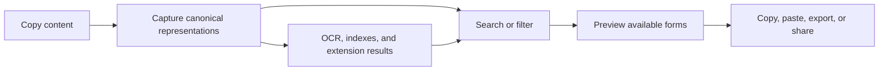

ClipsX treats captured content and generated conveniences differently. The
original representations remain canonical; previews, OCR, search indexes, and
extension results are derived and can be rebuilt.

## Find a clip

Use text search for exact words and identifiers. If you enable Meaning Search,
semantic results can also help with concepts or partially remembered phrases.
You can further organize and narrow history with pins, notes, tags, sources, and
content types.

## Inspect before reuse

A single copy can contain more than one representation, such as HTML and plain
text. Preview the available forms and select the one appropriate for the next
application instead of flattening the capture prematurely.

## Derived data is replaceable

Clearing or rebuilding a search index does not delete canonical clips. Changing
an embedding model creates a replacement semantic index. Extension transforms
also leave the original clip unchanged.

