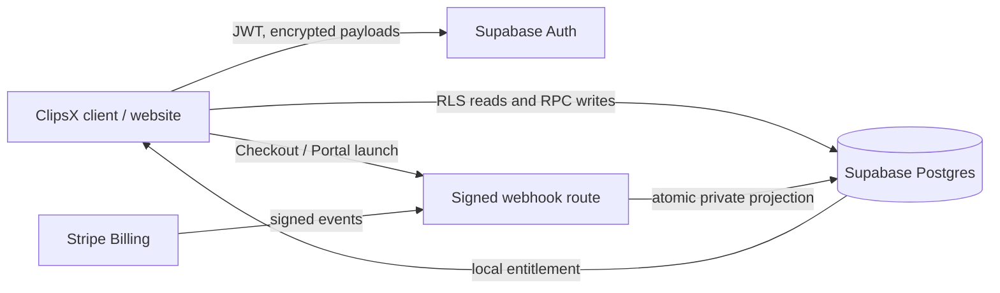
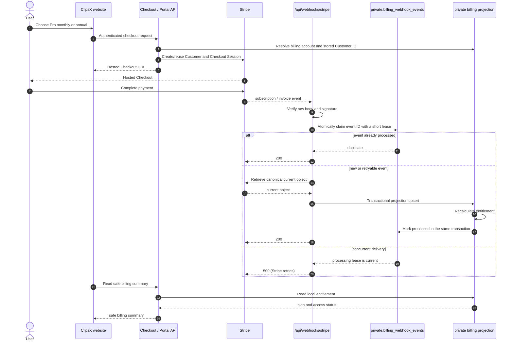
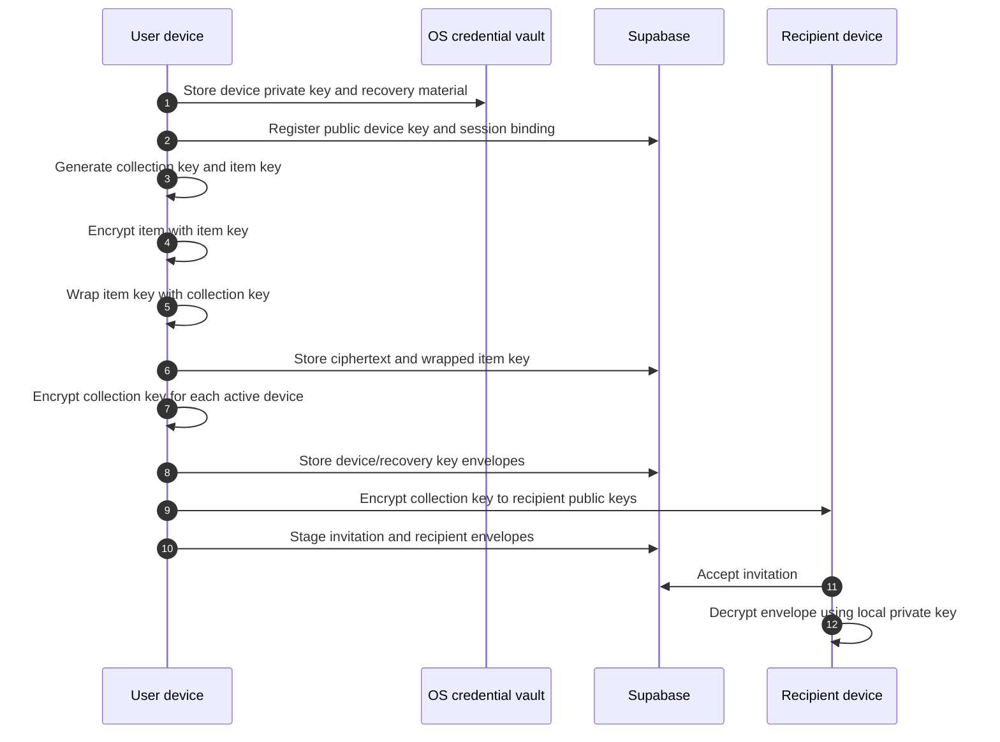
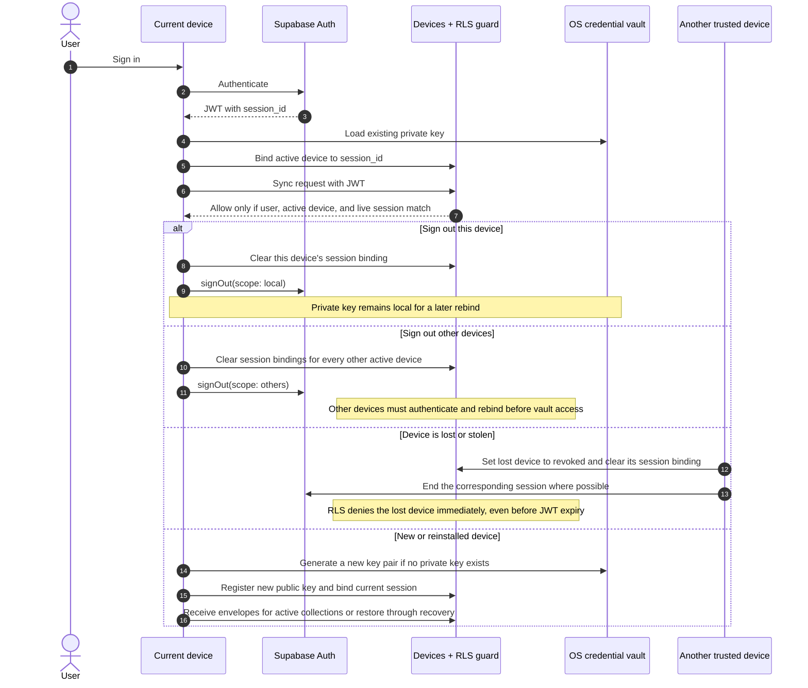

# Architecture and trust model

## System boundary

The client encrypts saved content before it reaches Supabase. Supabase stores
ciphertext, wrapped keys, encrypted metadata, and synchronization markers.
Stripe never sees vault content. Stripe billing tables live in a `private`
schema exposed only so the server-side `service_role` can use the Supabase API;
`anon` and `authenticated` receive no schema or table grants. Browser clients
receive only intentionally designed RPC or view results.

## Billing flow

The webhook endpoint is the billing processor for this low-volume v1. It
verifies the raw signed payload, claims the event, retrieves the canonical
Stripe object, and commits one atomic local projection. A `200` means that
projection is committed, was already committed, or the event is intentionally
ignored. A `500` means Stripe must retry.

Stripe events are not ordered and can be delivered more than once. The event
inbox is therefore an idempotency boundary, and the processor retrieves the
canonical Stripe object before changing the local projection. Failed events
remain visible for support replay; Stripe delivery retry is the only automatic
retry path.

### What happens if billing components fail?

| Failure | What happens now | Recovery path |
| --- | --- | --- |
| Signature invalid | Webhook returns 400 and writes nothing. | Investigate endpoint secret or an invalid sender. |
| Claim or projection fails | Webhook returns 500 and the event is marked `failed` when possible. | Stripe retries; support can replay the event locally. |
| Duplicate/out-of-order event | Inbox deduplicates event ID; webhook retrieves canonical object and rejects stale writes. | No manual action in the normal case. |
| Stripe API unavailable | Existing local entitlement remains in effect until its recorded deadline. | Stripe retries the webhook when the request fails. |

## Encrypted vault flow

The server can authorize who receives ciphertext but cannot decrypt it. Item
keys limit the blast radius of a single item; collection-key versions make
future key rotation explicit.

## Device and session lifecycle

Three things must not be confused:

- A **Supabase session** is the browser/app login represented by a JWT and a
  refresh token.
- A **device record** is the registered public key and its server-side access
  state.
- A **device private key** lives only in the OS credential vault. Logging out
  does not automatically erase it; revoking a lost device does not recover it.

### Device and session scenarios

| User situation | Server action | Key/material result | What the user experiences |
| --- | --- | --- | --- |
| Normal sign-in on a known device | Bind the current `session_id` to its active device record. | Existing private key stays in OS vault. | Sync resumes after the device proves it owns its existing key. |
| Sign out only this device | Clear its session binding, then use Supabase `signOut({ scope: 'local' })`. | Private key remains locally stored. | This device cannot sync until it signs in and rebinds. |
| Sign out all other devices | Clear other device session bindings, then use `signOut({ scope: 'others' })`. | Their keys remain on those devices. | Other devices must sign in again; this is not a lost-device response. |
| Sign out everywhere | Clear all bindings before global sign-out. | Keys remain local but no device is session-bound. | Every device must sign in and rebind. |
| Lost or stolen device | Mark that device `revoked` and clear its binding; invalidate its session where possible. | Its historical private key may still exist on the lost hardware. | Server-side vault access stops immediately; already downloaded ciphertext cannot be recalled. |
| New phone / reinstall | Register a new device key; do not reuse an absent private key. | New key receives fresh envelopes from a trusted device or recovery flow. | User can restore access without weakening old-device revocation. |
| Lost only device, recovery code available | Create a new device and decrypt the recovery-key backup locally. | Recovery material opens collection-key envelopes for the new device. | Vault access is restored; old device is revoked. |
| Lost recovery code and all devices | No server-side bypass exists. | Encrypted data cannot be decrypted. | Account/billing may remain, but encrypted vault recovery is impossible by design. |
| Password reset or security event | Auth may terminate sessions; the RLS session guard detects absence from `auth.sessions`. | Device key is unchanged but cannot be used until a valid session is rebound. | Re-authentication is required. |

Supabase sign-out revokes refresh tokens but an already issued access token can
otherwise remain valid until expiry. ClipsX therefore does not rely on
sign-out alone for vault protection: RLS/RPC checks require an active device,
a matching JWT `session_id`, and a still-live Auth session. For a lost device,
the explicit device revocation changes local authorization immediately.

## Access rules

- Public-schema tables must have RLS enabled and explicit grants. Public tables
  must not be assumed to be automatically exposed through Supabase's Data API.
- Browser reads use RLS. State-changing vault operations use narrow RPCs for
  membership, version, and optimistic-concurrency checks.
- Billing projection tables are private and server-only. The browser reads a
  safe billing summary, never raw Stripe records.
- Security-definer functions are exceptional. When required, they pin
  `search_path`, check the authenticated caller, revoke default `PUBLIC`
  execution, and grant only the intended role.
- Vault reads and writes require all of: device ownership, `status = active`,
  a matching JWT `session_id`, and a still-live row in `auth.sessions`.
- A sign-out action clears the affected device binding before it ends the Auth
  session. A lost-device action also changes the device status to `revoked`.

## Failure behavior

| Situation | Required behavior |
| --- | --- |
| Duplicate Stripe event | Record once; return success without re-granting allowance. |
| Events arrive out of order | Retrieve current Stripe object; use Stripe event timestamps to reject stale state. |
| Webhook processing fails | Mark the event failed when possible and return an error for Stripe retry; support can replay it. |
| Stripe temporarily unavailable | Existing local entitlement remains usable until its recorded policy deadline. |
| Payment becomes past due | Keep temporary grace access; show billing action required. |
| Grace expires / unpaid / canceled | Switch to read-only cloud retention; do not delete ciphertext. |
| Device revoked | Deny future requests immediately; already-downloaded data cannot be recalled. |
| Local sign-out | Clear the current device's binding; private keys remain only in its OS vault. |
| Sign out other devices | Clear their bindings and end refresh-token sessions; their old JWTs are also rejected by the session guard. |
| Lost only device | Require recovery code on a new device; without it, ciphertext cannot be recovered. |
| Reinstalled device | Treat as a new device identity; issue new envelopes after trust/recovery. |
| Item deleted | Delete ciphertext immediately; retain a tombstone for sync convergence. |
