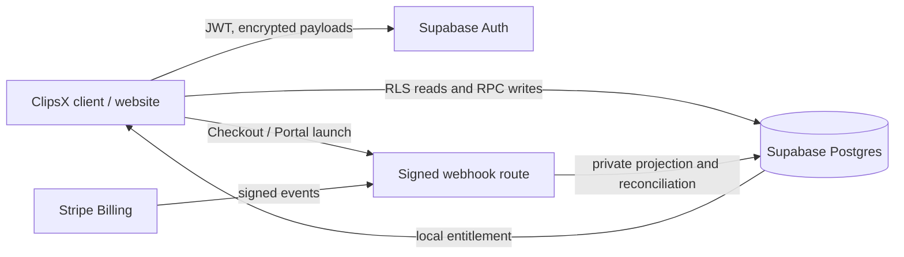
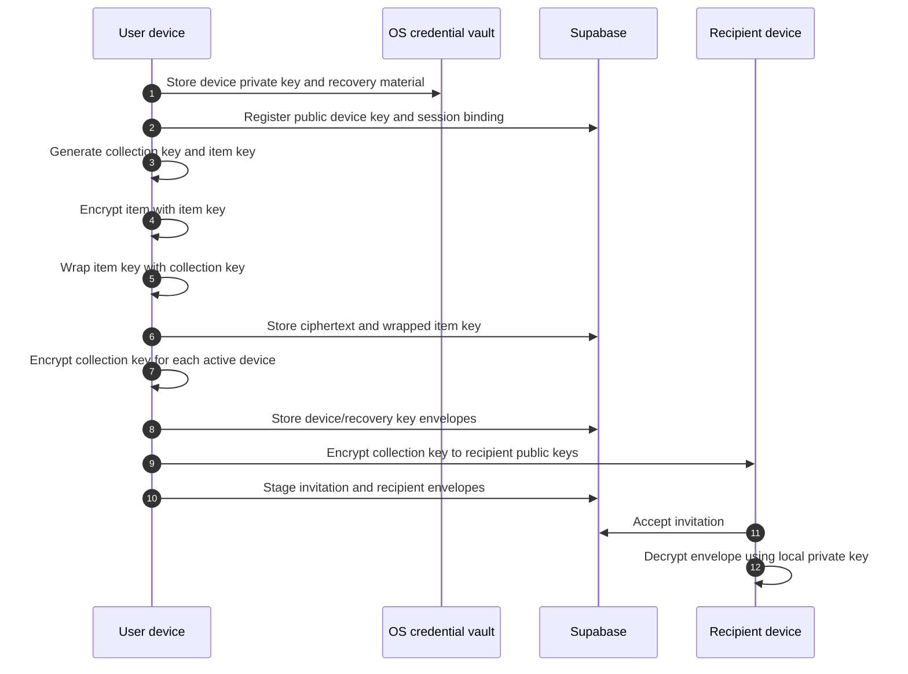

# Architecture and trust model

## System boundary



The client encrypts saved content before it reaches Supabase. Supabase stores
ciphertext, wrapped keys, encrypted metadata, and synchronization markers.
Stripe never sees vault content. Stripe billing tables live in a `private`
schema exposed only so the server-side `service_role` can use the Supabase API;
`anon` and `authenticated` receive no schema or table grants. Browser clients
receive only intentionally designed RPC or view results.

## Billing flow

```mermaid
sequenceDiagram
  autonumber
  actor User
  participant App as ClipsX website
  participant DB as Supabase private billing
  participant Stripe
  participant Hook as /api/webhooks/stripe

  User->>App: Choose Pro monthly or annual
  App->>DB: Resolve personal billing account
  App->>Stripe: Create or reuse Customer; create Checkout Session
  Stripe-->>User: Hosted Checkout
  User->>Stripe: Complete payment
  Stripe-->>Hook: subscription / invoice event
  Hook->>Hook: Verify raw body and signature
  Hook->>DB: Insert Stripe event ID once
  alt event already processed
    DB-->>Hook: duplicate
    Hook-->>Stripe: 200
  else new event
    Hook->>Stripe: Retrieve canonical current object
    Stripe-->>Hook: current object
    Hook->>DB: Transactional projection upsert
    DB->>DB: Recalculate entitlement and allowance
    Hook-->>Stripe: 200
  end
  App->>DB: Read local entitlement
  DB-->>App: plan, access status, allowance
```

Stripe events are not ordered and can be delivered more than once. The event
inbox is therefore an idempotency boundary, and the processor retrieves the
canonical Stripe object before changing the local projection. Failed events
remain retryable and a scheduled reconciliation compares local state to Stripe.

## Encrypted vault flow



The server can authorize who receives ciphertext but cannot decrypt it. Item
keys limit the blast radius of a single item; collection-key versions make
future key rotation explicit.

## Access rules

- Public-schema tables must have RLS enabled and explicit grants. Public tables
  must not be assumed to be automatically exposed through Supabase's Data API.
- Browser reads use RLS. State-changing vault operations use narrow RPCs for
  membership, version, and optimistic-concurrency checks.
- Billing projection tables are private and server-only. The browser reads a
  safe billing summary, never raw Stripe records.
- Security-definer functions are exceptional. When required, they pin
  `search_path`, check the authenticated caller, revoke default `PUBLIC`
  execution, and grant only the intended role.
- Device revocation checks both device status and the JWT session identifier.

## Failure behavior

| Situation | Required behavior |
| --- | --- |
| Duplicate Stripe event | Record once; return success without re-granting allowance. |
| Events arrive out of order | Retrieve current Stripe object; use Stripe event timestamps to reject stale state. |
| Webhook processing fails | Keep event pending, return an error for Stripe retry, alert, and reconcile later. |
| Stripe temporarily unavailable | Existing local entitlement remains usable until its recorded policy deadline. |
| Payment becomes past due | Keep temporary grace access; show billing action required. |
| Grace expires / unpaid / canceled | Switch to read-only cloud retention; do not delete ciphertext. |
| Device revoked | Deny future requests immediately; already-downloaded data cannot be recalled. |
| Item deleted | Delete ciphertext immediately; retain a tombstone for sync convergence. |
