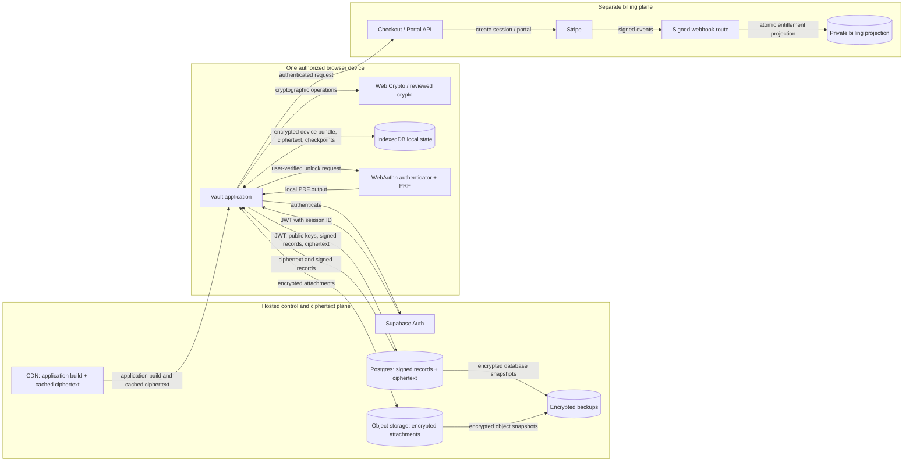
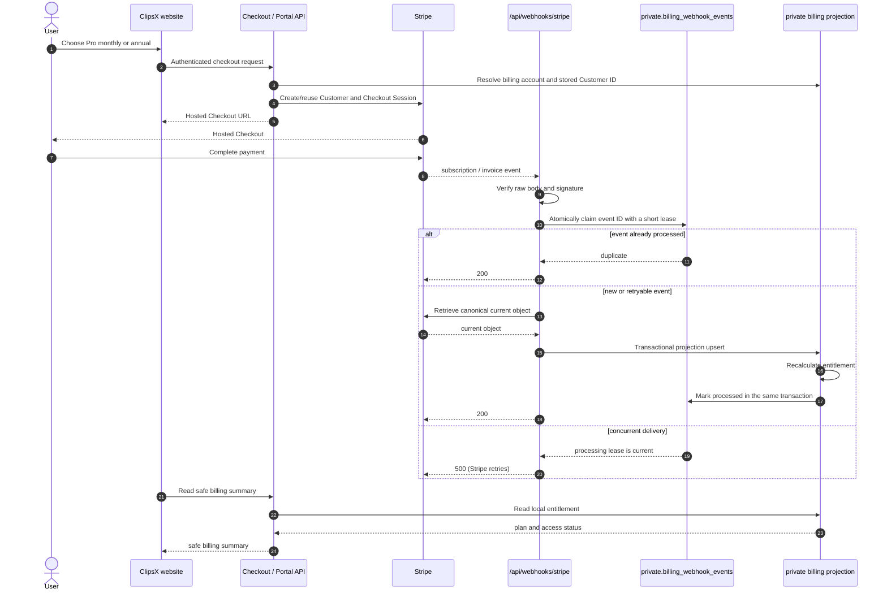

# Architecture and trust model

## Status and scope

This document is the normative target design for the browser-based ClipsX
encrypted vault. The billing backend described below is implemented; the
encrypted-vault schema and protocol are design requirements that must be
implemented before cloud notes or collection sharing are advertised as
end-to-end encrypted (E2EE). All vault key generation, encryption, decryption,
signing, verification, invitation, recovery, and key-rotation operations happen
inside the browser. Pseudocode and example algorithm families in this document
are protocol requirements and review aids, not production-ready cryptographic
code.

[Vault protocol v1](vault-protocol-v1.md) freezes the first implementation
profile. It is authoritative for v1 cryptographic suites, recovery enrollment,
browser unlock profiles, API transport, and deferred scope where this document
contains an earlier example or open decision.

ClipsX calls a deliberately saved clipboard item a **note** in the cryptographic
model. A **collection** is the sharing and key-management boundary for notes.
This preserves the product's existing encrypted-vault, saved-item, and
collection terminology while making immutable note revisions explicit.
Within the E2EE sections, “client” always means an authorized browser device;
there is no native cryptographic service or server-side decryptor in this
design.

## Architecture approval view

### System design

**Decision:** ClipsX is a browser-managed encrypted vault. An authorized,
uncompromised browser device is the only security boundary that handles vault
plaintext or private keys. Hosted services authenticate, synchronize,
transport, retain ciphertext, and project billing state; they do not decrypt
or author vault data.

This diagram is the approval view. It distinguishes the three planes that must
remain separate: the vault data plane, the account/control plane, and the
billing plane. The companion [data model](data-model.md) maps this design to
browser-local IndexedDB records and server tables.



### Trust boundaries and data placement

| Boundary | Purpose | May hold or observe | Must never hold |
| --- | --- | --- | --- |
| **Unlocked browser runtime** | Generates and uses keys; encrypts, decrypts, signs, and verifies. | Plaintext and unlocked keys only for the active session. | A guarantee against compromised same-origin code or endpoint compromise. |
| **Browser-local persistence** | Restores one browser device and its rollback anchors. | Encrypted device bundle, encrypted cache/drafts, public parameters, checkpoints, WebAuthn credential ID/PRF input. | Plaintext keys, notes, recovery secret, PRF output, or a hardware-backed-storage claim. |
| **Hosted vault services** | Auth, authorization, synchronization, object retention, and recovery from operational loss. | Identity/session metadata, public keys, signed records, ciphertext, sizes, timing, access patterns, membership metadata. | Vault plaintext, plaintext keys, recovery secret, local unlock material, or decrypted attachments. |
| **CDN and release pipeline** | Delivers the vault build and may cache ciphertext. | Build files, network metadata, cached ciphertext. | Independence from a malicious deployment: delivered JavaScript is in the vault trust boundary. |
| **Billing plane** | Creates Checkout/Portal sessions and projects verified Stripe events. | Billing identity, Stripe events, entitlement state. | Vault content or vault keys. |

Object storage, CDN, and backups are logical roles, not necessarily three
vendors. They are separate in the diagram because blobs, cached delivery, and
historical retention have different operational and deletion properties.

### Key and data path at a glance

```text
User verifies with a passkey or enters the vault passphrase
    -> unlocks this browser's encrypted device-key bundle in IndexedDB
        -> device private key opens a collection epoch-key envelope
            -> collection epoch key unwraps a note revision key
                -> revision key decrypts one note revision in the browser
```

The server stores the envelope, wrapped revision key, and ciphertext in this
chain, but never a plaintext vault key. Authentication obtains server access;
vault unlock obtains local device keys. Neither implies the other.

### Rationale and approval consequences

| Design choice | Why | Approval consequence |
| --- | --- | --- |
| Browser-only cryptography | Prevents hosted services from decrypting vault content. | The vault origin, release process, CSP, dependencies, and extensions are critical security controls. A compromised unlocked browser can expose plaintext. |
| Separate auth and vault unlock | A stolen or expired server session does not itself unlock private keys. | UI and APIs must never treat login/logout as cryptographic unlock/revocation. |
| Per-device keys and signed authorization | Avoids trusting a server-returned public key and enables device-level removal. | New devices require possession proofs plus an authorization rooted in the recovery trust root. |
| Collection epochs and per-revision keys | Limits future access after membership/device changes and avoids key reuse across revisions. | Revocation/removal requires an atomic epoch rotation; it protects future data only, never data already learned. |
| Signed, hash-linked history and checkpoints | Makes tampering, rollback, and conflicting history detectable. | Availability and permanently isolated split views cannot be solved cryptographically; independent checkpoint comparison/transparency remains a product decision. |
| Local encrypted device bundle | Avoids synchronizing device private keys. | Losing IndexedDB loses that device identity and its local rollback anchors; recovery or another authorized device is required. |
| Recovery secret | Allows recovery without a server-side escrow key. | It is a high-value offline root; compromise can authorize devices and expose covered epochs. Losing all devices and recovery makes ciphertext unrecoverable. |

### Approval gates

The billing backend is implemented. The E2EE vault is a target design and must
not be marketed as E2EE until its protocol, schema, browser controls, and test
vectors are implemented. Attachments are also planned: before upload is
enabled, define immutable attachment revisions, a fresh attachment key,
authenticated metadata, wrapping under the active collection epoch, retention,
and deletion behavior. Never reuse a note revision key for attachment bytes.

The v1 decisions and deferred work are consolidated in
[Vault protocol v1](vault-protocol-v1.md).

## Cryptographic protocol

### Protocol profile and encoding

Every key, ciphertext, envelope, signature, and signed operation carries a
`protocolVersion`, algorithm identifier, and key version. V1 uses the exact
profile in [Vault protocol v1](vault-protocol-v1.md#algorithm-profile): RFC
9180 X25519 HPKE, Ed25519 signatures, AES-256-GCM, SHA-256/HKDF-SHA-256,
scrypt for the local passphrase fallback, and deterministic CBOR. Browser
builds reject unknown or deprecated suites rather than guessing.

All keys and nonces come from a cryptographically secure random number
generator. The selected library's nonce-size and nonce-uniqueness requirements
are mandatory. Random nonces may be used only where the selected construction
and collision bounds permit them. Counters must be crash-safe and scoped to a
unique key. A nonce must never be reused with the same AEAD key.

Signed and authenticated structures use the
[RFC 8949 core deterministic CBOR encoding requirements](https://www.rfc-editor.org/rfc/rfc8949.html#name-core-deterministic-encoding).
Maps use fixed integer field labels defined by the protocol version;
identifiers have a single byte encoding; timestamps are UTC integer epoch
values; absent and empty values are distinct. Signatures and hashes are over a
domain-separation label followed by the deterministic CBOR bytes, never over an
implementation-specific object or JSON string. Domain labels distinguish at
least device authorization, proof of possession, invitation confirmation,
epoch transition, epoch envelope, note operation, recovery envelope, and log
checkpoint. Cross-platform test vectors are required before release.

### Key hierarchy

```text
WebAuthnCredential + PRF input
    -> produces a local PRF output after user verification
        -> derives BrowserUnlockKey with a domain-separated KDF
            -> decrypts BrowserDeviceKeyBundle from IndexedDB
                -> imports device private keys as non-extractable CryptoKeys

DeviceEncryptionKeyPair
    -> decrypts CollectionEpochKey(collectionId, epoch) envelope
        -> unwraps fresh NoteRevisionKey
            -> decrypts one note revision

DeviceSigningKeyPair
    -> signs device authorization, envelopes, epoch transitions,
       membership operations, note operations, and checkpoints

RecoverySecret
    -> standard KDF with domain separation
        -> RecoveryEncryptionKeyPair and RecoverySigningKeyPair
            -> decrypt recovery envelopes and authorize replacement devices
```

Signing, encryption/key-agreement, recovery, collection, and note-content keys
are separate key types and are never reused across purposes.
`BrowserUnlockKey` protects only the local serialized device bundle; it is not
a collection key, recovery key, account password, or server authentication
credential.

#### Device keys

Every browser profile/origin enrollment is a distinct device. It generates a
`DeviceEncryptionKeyPair` and a separate `DeviceSigningKeyPair` locally. The
private material may be exportable only during the initial in-memory
serialization needed to create the encrypted bundle. After unlock, the browser
imports it as non-extractable `CryptoKey` objects when the chosen algorithm is
available through Web Crypto. Plaintext private-key bytes must never be written
to IndexedDB, Cache Storage, local/session storage, logs, crash reports, or the
server.

Envelope encryption uses HPKE or an equivalent established high-level
construction. Do not implement direct RSA encryption or assemble low-level
key-agreement, KDF, and AEAD primitives without a reviewed standard
construction.

#### Browser device-key protection

The default persistent-browser profile is `webauthn-prf-wrapped`:

1. The browser creates a WebAuthn credential with user verification and checks
   that the
   [WebAuthn PRF extension](https://www.w3.org/TR/webauthn-3/#sctn-prf-extension)
   is enabled.
2. It generates a random, non-secret PRF input and stores that input plus the
   credential ID in IndexedDB.
3. After a user-verified `navigator.credentials.get()` ceremony, it keeps the
   PRF result inside the vault code and derives `BrowserUnlockKey` with a
   protocol-versioned, domain-separated KDF binding the origin, device ID, and
   bundle version.
4. It AEAD-encrypts the canonical `BrowserDeviceKeyBundle`, binding the same
   context as authenticated data, and stores only the ciphertext, nonce,
   algorithms, versions, PRF input, and credential ID in IndexedDB.
5. On unlock, it repeats the user-verified PRF operation, derives the same
   unlock key, verifies/decrypts the bundle, imports the device keys as
   non-extractable `CryptoKey` objects, and immediately releases serialized
   plaintext buffers.

The PRF output and `BrowserUnlockKey` never leave the browser and must be
removed from any `PublicKeyCredential` object before a WebAuthn response is
serialized or sent to a server. A normal WebAuthn signature is not a stable
encryption key and must not be used as one.

ClipsX does not call an OS keystore API or assume that browser keys are
hardware-backed. The WebAuthn authenticator may be platform-bound, synced, or
roaming, and the Web Crypto provider may be software or hardware; those details
are intentionally opaque to the browser application.

When WebAuthn PRF is unavailable, the supported fallback is
`vault-passphrase-wrapped`: a separate, user-entered vault passphrase is
processed locally by the versioned scrypt profile in
[Vault protocol v1](vault-protocol-v1.md#algorithm-profile). This passphrase is distinct
from the Supabase login password and recovery secret and is never uploaded.
Because an attacker who copies IndexedDB can test guesses offline, the UI must
require an adequate passphrase and disclose the weaker phishing/offline-guessing
properties.

The lower-assurance direct `indexeddb-nonextractable` compatibility profile is
not supported in v1. It has no cryptographically enforced user-unlock boundary
because same-origin JavaScript can use the keys whenever it can load them.

The encrypted bundle is local-only and is never synchronized to the server.
Losing IndexedDB creates a lost device, not a reason to upload or reuse its
private keys. A new browser profile generates a new device ID and keys, then
uses trusted-device approval or recovery.

#### Browser lock and runtime isolation

Supabase authentication and vault unlock are independent. Authentication
obtains a server session; unlock obtains local device keys. Neither one implies
the other. Initial enrollment binds a device to the authenticated Supabase
session. After ordinary sign-in creates a different session, an unlocked active
device must submit a signed `device-session-bind` command before ordinary vault
reads or mutations resume.

Unlocked device keys live in a dedicated module worker and remain only for the
active vault session. The worker accepts narrowly scoped requests and never
returns device private keys to React. Lock, page lifecycle termination, and a
same-account cross-tab lock event zeroize the worker-held key buffers and
terminate the worker; logout and idle-timeout wiring remain required before the
vault is complete. JavaScript garbage collection
cannot guarantee immediate physical memory erasure, so documentation and UI
must say that locking releases application access rather than proving memory
forensics erasure. Decrypted keys must not be retained in a service worker or
background sync task.

V1 runs at `clipsx.app/[locale]/vault` on the existing origin so it can reuse
the account session. This deliberately broadens the same-origin trust boundary
from the vault page to the web application. Vault routes therefore require a
strict nonce-based CSP, no third-party scripts, no unsafe inline/eval execution,
Trusted Types where supported, `Cache-Control: no-store`, no service worker,
dependency pinning, and no plaintext telemetry. Release updates must not
activate while the vault is unlocked; update provenance and rollback behavior
require explicit operational tests. These controls reduce XSS and supply-chain
exposure but cannot make server-delivered JavaScript independent of the server.

V1 uses `clipsx.app` as its WebAuthn relying-party ID, with vault operations
confined to `/[locale]/vault`. Because the vault shares the primary origin,
sibling same-origin code remains inside its trust boundary. The origin and
relying-party ID are versioned, security-critical configuration. An
origin/domain migration enrolls a new browser device through an unlocked
old-origin device or recovery; it must not
silently copy or reinterpret the old IndexedDB bundle.

#### Collection epoch keys

Each collection has an independent, random
`CollectionEpochKey(collectionId, epochNumber)`. Epoch numbers are monotonic
within a collection. A new epoch and a new random key are required for:

- revoking a device that could access the collection;
- removing a collection member;
- security-driven rotation or suspected compromise;
- changing the collection-key algorithm or key version; and
- adding a member in the ClipsX default policy, which creates a clean history
  boundary.

The epoch key is never uploaded in plaintext. It is encrypted separately to
every active device belonging to a member who is authorized for that epoch:

```text
DeviceEpochEnvelope {
    protocolVersion,
    collectionId,
    epochNumber,
    recipientDeviceId,
    senderDeviceId,
    encapsulation,
    ciphertext,
    algorithm,
    keyVersion,
    signature
}
```

The sender signs the canonical envelope header plus hashes of the encapsulation
and ciphertext. A recipient validates the sender, signature, epoch transition,
recipient identity, algorithms, and context before attempting decryption.
When cloud-assisted recovery is enabled, the creator also makes a separate
`RecoveryEpochEnvelope` for each eligible member account's active recovery key.
Recovery recipients are covered by the same signed recipient-set commitment;
there is no collection-wide plaintext recovery copy.

#### Note revision keys

Every immutable note revision receives a fresh random `NoteRevisionKey`.
Authenticated encryption protects the revision body. The revision key is then
wrapped with the collection epoch key active for that revision using a
library-backed AEAD key-wrap operation:

```text
encryptedContent = AEAD_Encrypt(NoteRevisionKey, plaintext, contentAAD)
wrappedRevisionKey =
    AEAD_Encrypt(CollectionEpochKey, NoteRevisionKey, keyWrapAAD)
```

The authenticated context contains fields equivalent to:

```text
schemaVersion
accountId or tenantId
collectionId
noteId
revisionNumber
collectionEpoch
authorDeviceId
contentType
previousRevisionHash
purpose ("note-content" or "note-revision-key")
```

The signed note operation additionally binds `operationId`, `ciphertextHash`,
the exact wrapped-key hash, timestamp or logical clock, and `operationType`.
A revision key reduces operational coupling and permits future selective
rewrapping. It does not contain compromise of the collection epoch key: anyone
with that epoch key and its stored wrapped keys can recover those revision
keys.

### Canonical signed records

#### Device authorization

A browser device must never trust a device public key merely because the server
returns it. The canonical `DeviceAuthorization` payload is:

```text
{
  protocolVersion,
  structureType: "clipsx-device-authorization",
  accountId,
  deviceId,
  encryptionPublicKeyAlgorithm,
  encryptionPublicKey,
  signingPublicKeyAlgorithm,
  signingPublicKey,
  clientType: "browser",
  enrollmentOrigin,
  keyProtectionProfile,
  clientCryptoCapabilitiesHash,
  keyVersion,
  createdAt,
  authorizedBy: { deviceId | recoveryKeyId },
  authorizationMethod,
  proofOfPossessionHash
}
```

The authorizing active device signs with its device signing key; recovery signs
with the recovery signing key. The mandatory recovery credential authorizes the
first device and is the initial account trust root.
The browser protection fields are authenticated metadata, not remote proof that
the browser actually followed the claimed local-storage policy.

Before authorization, the new device signs a fresh challenge with its signing
private key and decrypts an HPKE challenge addressed to its encryption public
key. The authorizer verifies both proofs, the authenticated account session,
and the displayed device identity. The signed authorization stores the hash of
those canonical proofs. This proves possession of both private keys.

For an existing trusted device authorization, users verify the new-device key
using a QR code, a short authentication string derived from the full
transcript, or an authenticated out-of-band channel. Device certificates form
a signed chain back to the recovery key. Clients cache the
highest authorization-log checkpoint. An append-only transparency service or
cross-device checkpoint comparison is recommended to expose server
equivocation.

#### Modifying operations

Possession of a symmetric collection key proves only access; it does not prove
which device authored a change. Every note, membership, invitation, envelope,
and epoch mutation is therefore signed by a separate device signing key. A note
operation signs a canonical payload equivalent to:

```text
{
  protocolVersion,
  operationId,
  operationType,
  collectionId,
  noteId,
  revisionNumber,
  collectionEpoch,
  previousRevisionHash,
  ciphertextHash,
  wrappedRevisionKeyHash,
  authorDeviceId,
  timestampOrLogicalClock
}
```

The server and browser devices accept it only if the author was active and
authorized for that collection and epoch, all hashes match the uploaded bytes,
and the signature verifies.

An epoch transition signs the collection ID, new epoch number, prior
transition hash, membership-state hash, recipient-set commitment, rotation
reason, algorithm, key version, creator device, and creation time. This binds
the new key distribution to the signed membership history without revealing
the epoch key.

## Device, invitation, and membership trust

### Device state and authorization

```text
pending -> active -> revoked
```

`pending` devices may upload possession proofs but receive no collection
envelopes. A valid `DeviceAuthorization` moves a device to `active`. `revoked`
is terminal: re-enrollment creates a new device ID and new keys. A server-side
status change without a valid signed authorization or revocation operation is
not a trusted cryptographic transition.

The implemented pending-registration transaction retains the proposed device's
signed `device-register` bytes and HPKE challenge-response commitment in the
private schema for 15 minutes. Existing-device activation is only through a
bound active author's `device-authorize` command after QR plus SAS comparison.
That transaction checks the account-log head and delivers one signed current
personal-collection envelope per collection while it creates the authorization
evidence and active device row. The browser flow protects the pending bundle
before upload, renders and locally restores the QR/SAS exchange, and keeps
authorizer signing and epoch keys inside the dedicated worker.

Recovery enrollment derives the recovery signing and encryption keys locally
from the confirmed phrase. The recovery root can authorize the same pending
proof when no active browser is available. Its recipient envelopes are marked
as recovery-signed records, and are never presented as if a lost browser device
had authored them.

Five concepts remain distinct:

```text
Supabase authentication:
    creates the server session used for API authorization.

Browser vault unlock:
    uses WebAuthn PRF or the vault passphrase to decrypt the local
    BrowserDeviceKeyBundle and import device keys for this vault session.

Browser vault lock:
    releases in-memory plaintext and key references without changing
    the server session or device authorization.

Logout:
    removes or invalidates application authentication/session state.

Server-side device revocation:
    blocks normal future API access and operations from that device.

Cryptographic revocation:
    creates a new collection epoch key and gives it only to devices
    that remain authorized.
```

Logout also locks the vault, but it does not delete the encrypted local device
bundle. Locking or logging out does not rotate collection epochs. “Forget this
browser” is a separate operation: while unlocked it signs/revokes the browser
device, completes required collection epoch rotations, commits the server
transition, then deletes the local IndexedDB database. Revoking a device and
deleting its envelopes does not delete keys or plaintext that device already
learned.

### Cross-user invitations

```text
Invitation: created -> accepted | expired | cancelled
Membership: invited -> active -> removed
```

Invitation acceptance is terminal for that invitation. Removed membership is
terminal; rejoining uses a new invitation, membership event, and epoch.

V1 invitations are always verified. Inviter and recipient compare a QR code,
grouped safety number, or high-entropy invitation secret through an
authenticated channel. The transcript binds both account/device keys,
collection, invitation ID, and expiry. The shipped delivery flow is a
user-carried link whose secret is in the URL fragment; the server receives only
the invitation ID and stores a domain-separated commitment. This resists server
key substitution when the independent verification channel is authentic. TOFU
is not offered in v1.

The inviter verifies the recipient's active device authorization chain and the
invitation transcript before creating any epoch envelopes. A mismatch,
changed key, invalid chain, expired invitation, or failed commitment aborts.

### Historical access

Every active collection membership has an explicit
`historyAccessFromEpoch`. ClipsX always creates a clean epoch when adding a
member. The default is no pre-invitation history:
`historyAccessFromEpoch = joinedEpoch`. Product/UI may deliberately select:

- full retained history;
- access from the joining epoch;
- access from a selected earlier epoch; or
- no pre-invitation revisions.

The inviter sends only allowed historical epoch envelopes plus the new current
epoch. Adding a member never implicitly grants old epoch keys. Removing a
member always creates a new epoch before another write is accepted.

## Replay, rollback, and fork detection

The server stores an append-only, signed operation log per collection,
including membership changes and epoch transitions. Note revisions are
immutable and hash-linked. Clients maintain durable local checkpoints for the
highest seen:

- device authorization-log position and root hash;
- collection membership-log position and root hash;
- collection epoch and transition hash; and
- note revision number and revision hash.

Browser devices reject duplicate operation IDs, invalid signatures, decreasing
epochs or revisions, revision-parent mismatches, unknown authors, envelopes for
the wrong recipient/context, and membership or epoch transitions that do not
extend the cached checkpoint. A new browser enrollment obtains a signed
checkpoint from its authorizing device or recovery state; it must not reset
security state merely because the server presents an empty or older history.

Browser devices persist highest-seen checkpoints in IndexedDB as authenticated
records bound to the device ID. Checkpoints are not secrets, but their integrity
must be protected by a device signature or a local authentication key inside
the encrypted device bundle. Clearing IndexedDB removes those local rollback
anchors, so a replacement browser must obtain checkpoints from the authorizing
device, recovery package, or independent transparency witness.

These mechanisms detect replay, rollback, and inconsistent branches once a
client sees a contradiction. Devices should compare signed checkpoints during
device onboarding and verified invitations. A future public or independently
operated key-transparency log can make persistent split views more detectable.
None of this prevents deletion, delay, selective response, or other denial of
service.

## Revocation and rotation semantics

When a device is revoked or a member is removed, one authorized device performs
the following transaction for every affected collection:

1. Sign the device-revocation or membership-removal operation.
2. Mark the device or membership revoked/removed for server authorization.
3. Generate the next monotonic epoch number and a fresh random epoch key.
4. Sign an epoch transition linked to the prior transition and new membership
   state.
5. Encrypt the new epoch key only to remaining authorized devices and each
   remaining member's policy-enabled active recovery key.
6. Upload the transition and signed envelopes atomically.
7. Use the new epoch for every later note revision and reject operations from
   revoked devices or removed members.

The removed endpoint can still decrypt epochs it knows. It cannot decrypt a
future epoch unless a remaining authorized endpoint or recovery secret leaks
the new key. Re-encrypting historical revisions under new keys is an optional,
expensive client-side operation. It may reduce exposure from a later old-key
compromise, but cannot retract copies already downloaded and is not guaranteed
retroactive revocation.

A collection epoch has the monotonic state:

```text
created -> current -> superseded
```

Only one epoch is current. A superseded epoch is never made current again.
Rollback and reactivation require a new epoch and new key material.

## Recovery

Recovery is a root-level E2EE capability, not a harmless backup code. At every
v1 onboarding, the browser generates the mandatory 256-bit `RecoverySecret`,
encodes it as the checksummed 24-word recovery phrase, and requires user
confirmation before device enrollment completes. It is not a user-selected
password and has no additional passphrase. It never reaches the server, logs,
telemetry, crash reports, support tooling, or analytics in plaintext.

Using a standard reviewed KDF, the browser derives independent recovery
encryption and signing seeds with protocol-versioned, domain-separated
contexts. Library key-import/derivation APIs produce the corresponding key
pairs; ClipsX does not implement scalar arithmetic. The server stores versioned
recovery public keys and encrypted recovery envelopes. The passkey-recovery
wrapper schema is reserved but deferred from the shipped v1 browser feature; if
added later, it is ciphertext of the recovery secret under a vault credential's
local PRF-derived key and never the sole recovery root. Every covered collection
epoch has:

```text
RecoveryEpochEnvelope {
    protocolVersion,
    accountId,
    collectionId,
    epochNumber,
    recoveryKeyId,
    encapsulation,
    ciphertext,
    algorithm,
    keyVersion
}
```

Its canonical context binds `accountId`, `collectionId`, `epochNumber`,
`recoveryKeyId`, `recoveryKeyVersion`, algorithm, and purpose. Epoch creators
sign the envelope hash as part of the epoch recipient-set commitment.

After all devices are lost, a replacement browser imports the secret locally,
verifies its checksum, derives the recovery keys, verifies the authenticated
recovery public-key record and log checkpoint, decrypts allowed recovery
envelopes, and uses the recovery signing key to authorize a new device. It then
revokes lost devices, rotates the recovery credential if compromise is
suspected, and creates new collection epochs before new writes.

If no device checkpoint, offline checkpoint, or independent transparency
witness survives, the recovered browser can verify signatures and hash links but
cannot distinguish the latest valid history from an older, internally
consistent signed history replayed by the server. It must disclose that
freshness limitation and compare checkpoints when another trusted source
becomes available.

Compromise of the recovery secret can expose every collection epoch for which
a recovery envelope exists and can authorize replacement devices. Recovery-key
rotation therefore creates a new signed recovery-key version, new recovery
envelopes as policy requires, and revokes the old version; it cannot erase old
epoch keys already recovered. Because v1 requires recovery enrollment, a user
who loses every authorized device uses the recovery phrase or an available
passkey-recovery wrapper.

## End-to-end flows

### Approval lifecycle

This is the operational lifecycle to approve. It is intentionally concise: the
detailed workflow requirements that follow are normative evidence for these
decisions, rather than a second system-design description.

| Flow | Browser-owned action | Hosted-service role | Approval condition |
| --- | --- | --- | --- |
| Create account | Select local protection and create recovery material. | Store public recovery keys and non-secret metadata. | E2EE onboarding requires confirmed offline recovery storage. |
| Enroll device | Generate new encryption/signing keys, protect the local bundle, and prove possession. | Authenticate and store public authorization records. | Trust is rooted in recovery; the server never adds a trusted device. |
| Read/write note | Unlock locally; verify state; encrypt/sign each revision with a fresh key. | Return/append ciphertext and signed records through bounded sync and command routes. | Readers verify signatures, checkpoints, context, and AEAD; writes extend one expected head only. |
| Add device/member | Verify identity, authorize keys, and distribute only authorized epoch envelopes. | Store public commitments, membership state, and ciphertext envelopes. | No local bundle copying, no envelopes while pending, and no implicit historical access. |
| Revoke/remove | Sign removal and rotate every affected collection to a fresh epoch. | Atomically commit removal, epoch transition, envelopes, and future-write restrictions. | Rotation completes before later writes; it protects future data only. |
| Recover/migrate | Recover/enroll a new device locally, or create signed version/epoch transitions. | Retain ciphertext/public state during documented compatibility windows. | Secrets never leave the browser; recovery uses the offline phrase; reject downgrades; no independent checkpoint means recovery freshness is not provable. |
| Detect replay/fork | Compare returned state to durable local checkpoints. | May be stale, unavailable, or malicious. | Preserve the trusted checkpoint and report non-extension; independent comparison improves detection. |

The end-to-end data path is: **authorize device -> unlock locally -> verify the
current signed state -> encrypt/sign in the browser -> atomically append
ciphertext and signed state -> verify on every reader**.

### Detailed workflow requirements

The following flows name the generator, material, upload, server-visible data,
verification, and abort conditions for implementation and test planning.

### 1. Account creation

The browser creates the authenticated ClipsX account, selects and verifies a
supported local key-protection profile, generates the mandatory recovery secret
locally, derives recovery public keys, and uploads only public keys, optional
passkey-recovery ciphertext, and signed version records. The server sees
account identifiers, public keys, algorithm/version, and timing. The browser
displays the checksummed offline secret and aborts E2EE onboarding until storage
is confirmed.

### 2. First-device enrollment

The first browser generates separate encryption and signing key pairs locally,
creates its canonical device-key bundle, encrypts that bundle using the chosen
`webauthn-prf-wrapped` or `vault-passphrase-wrapped` profile, and stores only
the encrypted record in IndexedDB. It then imports the unlocked private keys as
non-extractable `CryptoKey` objects where supported and signs/decrypts fresh
proof-of-possession challenges. Recovery signs the canonical device
authorization. It uploads public keys, proofs, authorization,
and non-secret device/protection metadata. The server sees no private key,
bundle ciphertext, PRF output, or unlock secret. Unsupported PRF after profile
selection, failed user verification, bundle self-check failure, invalid proofs,
mismatched account/session, unsupported algorithms, or a changed recovery root
aborts.

### 3. Creating an encrypted collection

The active device creates epoch `1` and its random collection epoch key. It
signs the collection creation, initial membership, and first epoch transition;
encrypts the epoch key separately to every authorized owner device and the
owner's active recovery key when enabled; then uploads collection metadata
ciphertext, transition, envelopes, and signatures. The server sees
ownership/membership relationships, recipient device IDs, sizes, and timing.
Invalid authorization chains, duplicate epoch numbers, or incomplete recipient
commitments abort.

### 4. Creating or updating an encrypted note

The author reads and verifies the current membership/epoch checkpoint,
generates a fresh revision key, AEAD-encrypts note content with canonical AAD,
wraps the revision key under the current epoch key, hashes ciphertext and
wrapped key, and signs the note operation. It uploads ciphertext, nonces,
wrapped key, AAD version, hashes, and signature. The server sees note/collection
IDs, revision/epoch, content type if unencrypted, size, author device, and
timing. Signature, authorization, expected-parent, current-epoch, hash, nonce,
or AEAD-context failure aborts.

### 5. Adding a second device

The new browser profile creates its own unlock credential/passphrase wrapper,
device ID, and both device key pairs; it never copies another browser's local
bundle. It proves key possession. An existing unlocked trusted browser compares
a QR/SAS or authenticated out-of-band transcript, verifies the account and
cached device-log checkpoint, signs the device authorization, and encrypts each
permitted collection epoch key to the new device. Recovery may authorize when
no browser device remains. The server receives public records and ciphertext
envelopes, not either browser's IndexedDB record. No envelope is issued while
the device is pending; failed local bundle protection, possession, user
verification, authorization chain, or checkpoint consistency aborts.

### 6. Inviting another user

The inviter creates a signed verified invitation with expiry and commitment.
The recipient proves control of an active authorized device and both parties
compare the invitation transcript through an authenticated channel. The
user-carried link keeps its high-entropy secret in a URL fragment, so only
commitments, public records, and invitation metadata reach the server. Key
changes, invalid device chains, failed commitments, expiry, or transcript
mismatches abort. TOFU is not offered.

### 7. Adding a member with or without historical access

After invitation acceptance, the inviter selects and signs
`historyAccessFromEpoch`, creates a fresh joining epoch and key, signs the
membership and epoch transition, and encrypts the joining key to all current
devices and eligible recovery keys. For full/selected history it additionally
encrypts only allowed prior epoch keys that the granting device is itself
authorized to possess to recipient devices and the recipient's recovery key
when enabled; for the default no-history policy it sends no prior keys. The
server sees membership and the chosen epoch boundary, not key plaintext. An
implicit history default, missing recipient authorization, stale membership
head, unauthorized history grant, or envelope outside the allowed range
aborts.

### 8. Revoking a device

An active device signs revocation, clears the lost device's session binding,
asks Auth to invalidate its session where possible, and creates new epochs for
every collection the device could access. It encrypts new keys only to
remaining authorized recipients and eligible recovery keys, then uploads
revocation, transitions, and envelopes atomically. The server sees the revoked
device and affected collections. A write using the old epoch after transition
or any later envelope for the revoked device is rejected. Previously learned
data remains readable.

### 9. Removing a collection member

An authorized owner signs removal and its effective log position, creates and
signs a new epoch, and envelopes its new key only to remaining members'
authorized devices and policy-enabled recovery keys. Removal and rotation
commit before subsequent writes. The server sees membership removal and
recipient set. Missing owner authority, stale log head, absent rotation, or an
envelope to the removed member or that member's recovery key aborts.

### 10. Recovering after all devices are lost

The replacement browser first establishes a new local WebAuthn-PRF or
vault-passphrase protection profile, imports the recovery secret locally, verifies
the checksum and recovery public-key history, decrypts recovery envelopes, and
generates fresh browser-device keys. It encrypts the new local bundle in
IndexedDB; recovery signs its device authorization. The browser revokes lost
devices and rotates affected epochs before uploading new writes. The server
sees a recovery-authorized device and rotations, never the unlock material,
recovery secret, bundle, or recovered keys. Wrong checksum, local bundle
protection failure, invalid envelope context, revoked recovery version,
signature failure, or inconsistent checkpoints aborts.
Without a surviving independent checkpoint, a valid-but-stale recovery view is
not guaranteed to be detected during this flow.

### 11. Rotating algorithms or key versions

An active browser build that supports both profiles signs an upgrade transition naming
old/new protocol suites. Device-key changes create a replacement device/key
identity with a higher protocol key version and fresh possession proofs;
collection-key changes create a new epoch and new envelopes; note writes use
per-record algorithm IDs. During the documented compatibility window, clients
read old records but create only the selected new format. Unknown downgrade,
unsupported required suite, stale transition, or missing envelopes aborts. The
server never converts plaintext.

### 12. Handling conflicting note updates

ClipsX defaults to optimistic concurrency, not a CRDT. A writer signs its
expected `previousRevisionHash` and next revision number. The server atomically
accepts only one operation extending the current head. A concurrent loser gets
a `409` conflict response. The implemented browser flow keeps its plaintext
draft only in worker/UI memory (not IndexedDB), re-downloads bootstrap and the
affected collection through the verified paths, then displays the verified
remote revision. The user can keep remote and discard the draft, reapply local,
or edit a manual merge; reapply and merge both sign a fresh revision against
the refreshed head. Lock, page exit, cross-tab lock, and vault UI teardown
clear the draft and all rendered plaintext. No ciphertext is silently
overwritten, no draft is claimed durable, and no merge-safety claim is made.
Invalid parent or duplicate revision aborts normal commit.

### 13. Detecting a stale or replayed response

The browser compares returned signed log heads, epochs, revision numbers, parent
hashes, and operation IDs with durable local maxima. A decrease, unknown fork,
duplicate operation, invalid signature, or non-extending transition is shown as
a security/synchronization error and is not used to replace local trusted
state. The browser may compare checkpoints with another device or transparency
log. It can detect inconsistency but cannot force fresh data or distinguish
every malicious delay from an outage.

## Server responsibilities and access rules

The server may store:

- public device and recovery keys;
- signed device authorization, revocation, invitation, membership, epoch,
  operation, and checkpoint records;
- encrypted device and recovery epoch envelopes;
- encrypted note revisions and wrapped revision keys;
- encrypted attachments;
- non-secret indexes, sync markers, and unavoidable metadata; and
- billing records in the separate private projection.

The server must never receive in plaintext:

- device private keys;
- browser device-key bundles, WebAuthn PRF outputs, browser unlock keys, or
  vault passphrases;
- the recovery secret or recovery private material;
- collection epoch keys;
- note revision keys;
- note plaintext or decrypted attachments; or
- sensitive note metadata such as titles or labels when the client can include
  it inside encrypted content.

Public-schema vault tables require RLS and explicit grants. Browser reads use
RLS or the bounded vault sync route; browser clients have no direct mutation
grants. State-changing vault operations use `POST /api/vault/commands`: its
Next.js route handler verifies the canonical command, signature, account,
active-device/recovery authority, and matching JWT `session_id`, then invokes a
private transaction that enforces membership, current epoch, append-only, and
optimistic concurrency constraints. `device-session-bind` is the narrowly
scoped exception: it verifies an active device signature before replacing that
device's prior session binding. This avoids relying on a deprecated
database crypto extension for Ed25519 verification. These server checks improve
access control and availability behavior but are not substitutes for browser
signature or ciphertext verification. The browser performs all vault plaintext
and private-key operations locally; no server endpoint performs decrypt/sign
operations on its behalf.

The implemented encrypted write is `note-append`: bootstrap returns the current
collection-operation head with the verified epoch envelope, and the worker
keeps both only while unlocked. The route verifies the device command and its
embedded immutable-revision signature before a private transaction locks the
head, validates the bound session, owner/editor membership and current epoch,
then atomically appends the next immutable revision and collection ledger entry.

Verified read sync is also implemented for the current single-device personal
collection profile. A no-store route returns only canonical signed operation,
ciphertext, and tombstone records; the worker validates the chain, signatures,
hashes and AEAD context before returning decrypted item fields to React. A
signed delete binds the current collection and note revision heads. Its private
transaction removes stored note ciphertext/key wraps, marks the note deleted,
and records the operation-linked non-secret tombstone atomically. The worker
accepts a tombstone only when its signed delete operation binds the same note
and accepted revision hash, then omits that item from the result. Lock clears the
rendered item state and terminates the worker. Multi-device/member records are
intentionally rejected until their signed public-key directory is implemented.

## Enforceable invariants

- Device private keys exist in plaintext only transiently inside an unlocked
  browser execution context and never leave it.
- IndexedDB never contains a plaintext device private key, browser unlock key,
  WebAuthn PRF output, recovery secret, collection key, revision key, or note.
- The persistent browser device bundle is protected by authenticated encryption
  and bound to its origin, device ID, protection profile, and format version.
- Supabase authentication does not unlock the browser vault, and browser unlock
  does not by itself authorize server access.
- Recovery secrets and recovery private material never reach the server.
- Collection epoch keys and note revision keys never reach the server in
  plaintext.
- Every encrypted note revision references exactly one collection epoch.
- Every active envelope targets a device authorized for that epoch or a valid,
  policy-enabled recovery key belonging to a member authorized for that epoch.
- Revoked devices and removed members receive no envelopes for later epochs.
- Collection epoch numbers never decrease or repeat.
- Note revision numbers never silently decrease or overwrite another revision.
- Every modifying operation has a valid signature from a device active and
  authorized at that log position.
- Every key-bearing or ciphertext-bearing structure carries protocol,
  algorithm, and key versions.
- Ciphertext and wrapped keys are authenticated with canonical contextual data.
- The server cannot add a trusted device without valid possession proofs and a
  device-authorization signature rooted in recovery.
- Logout is never treated as cryptographic revocation.
- Lock and logout release in-memory browser key references; neither is claimed
  to erase ciphertext, learned keys, or prior plaintext copies.
- Adding a member never implicitly grants historical access.
- Removing a member creates a new epoch before any subsequent write.
- Only one collection epoch is current, and a superseded epoch is never
  reactivated.
- Signatures are validated before decrypting newly supplied key material.
- Secrets and plaintext never enter logs, telemetry, analytics, crash reports,
  or error messages.

## Legacy shared-key migration

Partially migrated collections carry an explicit `cryptoFormat` and
`migrationState` (`legacy`, `dual-read`, `epoch-write`, or `complete`) plus the
highest migrated revision. The server cannot decrypt or migrate content.

1. Release browser builds that create separate device signing and encryption keys and
   signed device authorizations.
2. Introduce versioned collection epochs and interpret the legacy shared
   collection key as epoch `0`.
3. In an authorized browser device, generate a fresh epoch `1` key and signed
   transition.
4. Create epoch envelopes for authorized devices and recovery.
5. Write all new revisions with fresh per-revision keys under the current
   epoch.
6. Read legacy records only in browser builds within the compatibility window.
7. Lazily migrate an old note revision when an authorized browser reads or
   modifies it, preserving its legacy hash linkage in the migration operation.
8. Optionally run an explicit browser-side migration while the vault is
   unlocked.
9. Stop creating legacy-format records once the account's minimum supported
   browser version understands epoch writes.
10. Retain and document a dual-read compatibility window; unsupported browsers
    become read-blocked rather than causing a downgrade.
11. Remove legacy key handling only after all supported browser builds understand the
    new format and migration completeness is verifiable.

Migrating or deleting the legacy server envelope cannot erase the legacy key
from devices that already obtained it.

## Billing flow

Stripe billing is separate from E2EE. The webhook endpoint is the billing
processor for this low-volume v1. It verifies the raw signed payload, claims the
event, retrieves the canonical Stripe object, and commits one atomic local
projection. A `200` means that projection is committed, was already committed,
or the event is intentionally ignored. A `500` means Stripe must retry.



Stripe events are not ordered and can be delivered more than once. The event
inbox is therefore an idempotency boundary, and the processor retrieves the
canonical Stripe object before changing the local projection. Failed events
remain visible for support replay; Stripe delivery retry is the only automatic
retry path. Billing tables live in `private` and are exposed only to
`service_role`; browser clients receive a deliberately limited summary.

### What happens if billing components fail?

| Failure | What happens now | Recovery path |
| --- | --- | --- |
| Signature invalid | Webhook returns 400 and writes nothing. | Investigate endpoint secret or an invalid sender. |
| Claim or projection fails | Webhook returns 500 and the event is marked `failed` when possible. | Stripe retries; support can replay the event locally. |
| Duplicate/out-of-order event | Inbox deduplicates event ID; webhook retrieves canonical object and rejects stale writes. | No manual action in the normal case. |
| Stripe API unavailable | Existing local entitlement remains in effect until its recorded deadline. | Stripe retries the webhook when the request fails. |

## Failure behavior

| Situation | Required behavior |
| --- | --- |
| Invalid AEAD tag, hash, or signature | Do not decrypt/use the record; report a non-secret integrity error. |
| WebAuthn PRF unavailable for a PRF-protected device | Do not downgrade or overwrite the bundle; allow another supported authenticator, device recovery, or an explicit rewrap from an already unlocked session. |
| Vault passphrase is wrong | Return a generic local unlock failure without changing or uploading the bundle; rate-limit attempts in the UI while acknowledging copied blobs permit offline guessing. |
| IndexedDB is cleared, corrupted, or evicted | Treat this browser identity as lost; enroll a new device through another authorized browser or recovery. |
| Browser locks or logs out | Release plaintext and key references, clear rendered secrets and decrypted drafts, and notify other same-origin tabs to lock. |
| User chooses “Forget this browser” | While unlocked, sign and commit revocation/required epoch rotations first, then delete the local IndexedDB database; if remote rotation cannot complete, explain that local deletion alone is not cryptographic revocation. |
| Browser or vault build changes while unlocked | Defer activation until lock/reload; require the new build to re-unlock and revalidate local/server checkpoints. |
| Vault origin or WebAuthn relying-party ID changes | Treat the new origin as a new browser device and authorize it from the old origin or recovery; never weaken the relying-party scope or copy the old local bundle. |
| Unsupported cryptographic suite | Refuse the operation without downgrade; require a supported browser/build or an explicit signed migration. |
| Decreasing epoch/revision or non-extending log | Preserve local checkpoint and report rollback/fork suspicion. |
| Device revoked | Deny server access and rotate every affected collection; historical access may remain. |
| Member removed | Rotate before later writes and issue no future envelope to that member. |
| Local or global logout | Clear relevant session bindings; do not claim that local keys or learned plaintext disappeared. |
| Lost only device | Require the recovery secret; without recovery, ciphertext is unrecoverable. |
| Recovery secret suspected compromised | Authorize a safe device, rotate recovery version and affected epochs, and disclose limits for already covered epochs. |
| Conflicting note write | Preserve the losing draft and require a new revision after verification/merge. |
| Server deletes or withholds data | Surface a synchronization/availability failure; cryptography cannot restore unavailable ciphertext. |
| Item deleted | Follow product policy by deleting server ciphertext and retaining a signed non-secret tombstone; do not claim deletion from prior recipients or backups is cryptographic erasure. |
| Duplicate Stripe event | Record once and return success without re-granting allowance. |
| Stripe projection fails | Return an error for Stripe retry and retain support-replay state. |

## V1 decisions and deferred work

- Recovery phrase enrollment is mandatory. The optional passkey-recovery
  wrapper is reserved but deferred from the shipped v1 browser feature.
- Verified invitations are required. V1 does not offer TOFU invitations.
- New members receive no pre-invitation history by default; owners may grant
  selected or all retained history explicitly.
- Signed local checkpoints and cross-device comparison ship in v1. An
  independently witnessed transparency service is deferred.
- WebAuthn PRF is the preferred unlock profile; the scrypt vault-passphrase
  profile is the explicit fallback; direct `CryptoKey` persistence is excluded.
- The vault shares `clipsx.app` with the web app and therefore requires the
  compensating same-origin CSP, release, telemetry, and service-worker controls
  stated above.
- Attachments are deferred. They require their own immutable revision, fresh
  attachment key, encrypted manifest, retention, and deletion design.
- The v1 cryptographic suite, CBOR profile, command transport, and test-vector
  contract are frozen in [Vault protocol v1](vault-protocol-v1.md).

## Glossary

- **Device key:** one of a device's separate encryption/key-agreement or
  signing key pairs; private material remains local.
- **Browser device:** one ClipsX enrollment scoped to a browser profile and
  vault origin, with its own device ID, key pairs, encrypted local bundle, and
  rollback checkpoints.
- **Browser device-key bundle:** canonical local serialization of the browser
  device's private keys and self-check metadata, stored only as authenticated
  ciphertext in IndexedDB.
- **Browser unlock key:** ephemeral symmetric key derived locally from WebAuthn
  PRF or a vault passphrase KDF and used only to decrypt the browser device-key
  bundle.
- **Vault unlock:** local operation that decrypts/imports browser device keys;
  distinct from Supabase authentication, logout, and device revocation.
- **Device authorization:** signed record binding an account and device ID to
  proven encryption and signing public keys.
- **Collection:** sharing, membership, and key-rotation boundary containing
  encrypted notes.
- **Collection epoch:** monotonic membership/key state for one collection.
- **Collection epoch key:** random symmetric key used to wrap revision keys in
  one epoch; never stored server-side in plaintext.
- **Note revision key:** fresh symmetric content key for one immutable note
  revision.
- **Envelope:** a contextual, versioned ciphertext that delivers an epoch key
  to exactly one device or recovery key.
- **Recovery secret:** high-entropy offline root secret from which recovery
  private material is derived.
- **Recovery key:** versioned encryption or signing key pair derived from the
  recovery secret; only public parts are stored in plaintext by the server.
- **Cryptographic revocation:** creation and restricted distribution of a new
  collection epoch key to exclude a device or member from future content.
- **Historical access:** explicit earliest epoch whose keys a membership may
  receive.
- **Authenticated associated data (AAD):** canonical unencrypted context bound
  to an AEAD ciphertext so it cannot be moved to another account, collection,
  note, revision, epoch, author, or purpose without detection.
