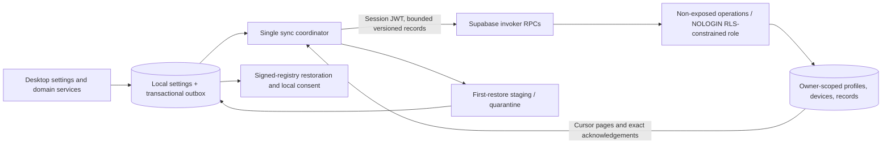

# Desktop configuration sync

## Implemented architecture

Configuration sync v1 is opt-in and independent of billing, organizations, and
encrypted browser-vault enrollment. Supabase authenticates each desktop session.
The server can read configuration; this feature is not end-to-end encrypted.
Full account deletion is a separate roadmap item.



The desktop SQLite schema retains its numbered migrations. `013_sync.sql` owns
record capture, per-account/per-generation outboxes and acknowledged revisions,
local session epochs, clock state, staged first restores, quarantine, and pending
domain effects. Configuration-table triggers capture local writes/deletions in
the same transaction, including import/reset paths. Applying a remote record
suppresses outbound capture. No compatibility or dual-read schema is provided.

### Domain baselines

Supabase migrations remain flat and use CLI-generated timestamp prefixes, in order:
`platform_foundation`, `configuration_sync`, `workspaces`, `billing`,
`vault_foundation`, `vault_devices`, `vault_content`, `vault_sharing`.
These replace the historical baseline. Billing contains the final direct webhook
projection, not the superseded worker functions. Future changes use
`supabase migration new <domain>_<change>` and append migrations.

## Data contract

| Kind | Key / value | Placement |
| --- | --- | --- |
| `profile_setting` | `ui.theme`: system/light/dark; `ui.language`: language tag; `ui.default_output_format`: original/plain_text; `ui.show_copy_toast`: boolean | Portable preferences |
| `profile_setting` | `search.syntax_mode`: simple/advanced; `search.enabled_sources`: bounded source IDs | Preferred behavior, independent of provider availability |
| `profile_setting` | `artifacts.ocr.enabled`: boolean; `artifacts.ocr.language`: language tag or auto | Preference only; engines and results stay local |
| `renderer_preference` | `mime:`, `facet:`, or `capability:` target; renderer ID | One independently revised selection per target |
| `extension_intent` | Stable package ID; `{enabled: boolean}` | Desired signed-registry installation and enablement |
| `extension_setting` | `packageId/settingId`; approved boolean/number | Requires portable declaration in the signed package and server approval |
| `shortcut` | Stable command ID; portable accelerator | App shortcuts, including core.copy/favorite/pin/open/delete |

Each record has a payload or a payload-free tombstone, HLC physical milliseconds
and counter, source device ID, and server cursor. Ordering is lexicographic by
physical time, counter, and device UUID. Incoming clocks are observed before
subsequent local edits. Revisions more than five minutes ahead receive
`clock_skew`; clients correct their sync-clock offset using server time.

The contract excludes clipboard content, notes, tags, files, credentials,
permission grants, provider endpoints/models, capture settings, window state,
autostart, OS-global activation shortcuts, extension update policy, developer
packages, diagnostics, caches, indexes, jobs, and derived results. Being stored
in the desktop profile table does not make a value eligible. Arbitrary extension
text settings are local in v1; only explicitly portable booleans/numbers are
eligible for server approval.

`sync_internal.extension_settings` is a release-owned approval catalog, not
user-editable metadata. After verifying a signed release and reviewing its
portable declarations, add matching package/setting IDs and value kinds through
a migration or release administration SQL. Do not approve settings merely because
they are labeled non-secret. Client runtime validation still requires the
installed signed manifest. No settings are approved implicitly or via user JWTs.

## Database and API behavior

- `public.sync_profiles`: account owner, generation, initialized flag, and
  per-account committed cursor. Profile locking serializes mutations and resets.
- `public.sync_devices`: account/device identity, authenticated session ID,
  display name, last seen, and revocation. A revoked session cannot enroll a new
  ID. A fresh authenticated session can enroll separately.
- `public.sync_records`: current winning records and tombstones in a generation;
  unique account/generation cursor supports ordered pagination.
- `sync_internal`: not exposed through PostgREST. Narrow executors run as
  `configuration_sync_executor`, a NOLOGIN/NOBYPASSRLS role. Owner-scoped policies
  constrain that role. Authenticated clients have no raw table reads or writes.
  The only postgres-owned helpers return the authenticated user ID and verify
  the JWT session against `auth.sessions`; they accept no caller-supplied owner.

All public entrypoints are security invokers with explicit authenticated grants:

| RPC | Behavior |
| --- | --- |
| `sync_enroll_device(device_id, device_name)` | Validate live Auth session; return enrolled device, generation, initialization state, server time |
| `sync_apply_batch(protocol_version, generation, device_id, after_cursor, records)` | Validate device/session and generation; apply deterministically newer records; return exact revision acknowledgements, winning records, next page, cursor, hasMore, and server time |
| `sync_list_devices()` | List own device metadata for an active enrolled session |
| `sync_revoke_device(device_id)` | Revoke an own device under the profile lock |
| `sync_reset_profile(generation)` | Atomically clear records and increment generation; old uploads cannot resurrect them |
| `sync_replace_profile(generation, device_id, records, replace)` | Atomically initialize an empty profile or replace it with a new generation; any invalid record rolls back the entire operation |

RPC argument names have a `p_` prefix. Protocol version is 1. Upload and download
pages have at most 100 records; upload JSON is capped at 1 MiB and individual
values at 64 KiB. Initial/replacement snapshots support 1,000 records and 4 MiB,
processed in bounded chunks within one transaction. Cursors advance only through
returned records. Acknowledgements include accepted/superseded/invalid/clock_skew
and identify the exact uploaded revision; a later local edit is never cleared by
an earlier acknowledgement. Invalid individual uploads do not block valid peers.

## User lifecycle and recovery

An empty cloud is initialized atomically from the device. For an existing cloud,
**Use cloud settings** is the default; **Replace cloud with this device** requires
explicit confirmation. First restore stages all pages before replacing portable
local values. Interrupted downloads preserve local settings and resume with the
staged cursor. Edits during download retain their outbox revisions.

Changes synchronize on startup, reconnect, manual action, 500 ms debounced
mutations, and a 60-second poll. One coordinator drains bounded pages with
backoff and jitter after failures. Sign-out pauses sync and retains local data.
Account changes and reconnect decisions increment a local epoch; late responses
from the previous epoch are ignored. Remote generation changes pause sync and
require a new connection choice rather than uploading old settings automatically.

Extensions restore only through the existing signed registry/checksum verifier.
Installed packages are not silently upgraded by sync. Unavailable packages,
unsupported portable declarations, missing commands, and shortcut collisions
remain visible as pending effects. External capability grants are never copied.
Corrupt/unsupported records are quarantined while other records continue;
the UI supports retry/discard and pending-effect retries without showing payloads.

## Local verification and rollout

Run from `clipsx-web`:

```powershell
npm run supabase:reset
npm run test:db
npm run test:unit
npm run typecheck
npm run lint
npx supabase db advisors --local --level warn --fail-on error
npm run supabase:generate-types:local
```

Copy generated database types to desktop `src/shared/auth/database.types.ts` when
the contract changes. Desktop checks include `npm run type-check`, `npm run lint`,
and `cargo test --manifest-path src-tauri/Cargo.toml --bin clipsx configuration_sync`.
The executable binary owns sync modules; `cargo test --lib` does not cover them.

The database tests cover independent authenticated sessions, restore, forged IDs,
direct access denial, revocation, stale generations, duplicate uploads, clock
skew, bounded pagination, and atomic replacement failure. Desktop tests cover
transaction rollback, late responses, exact acknowledgements, quarantine,
tombstones, renderer independence, and staged restore.

This baseline is for a fresh local database. Hosted reset/deployment is not part
of local verification. Hosted rollout requires the matching fresh baseline,
Auth callback configuration, approved extension-setting catalog, generated client
types, and installed two-device certification. Verify the existing
`/auth/desktop/callback` bridge with desktop PKCE; callback unit tests alone do
not certify the hosted OAuth provider or OS deep-link registration.
