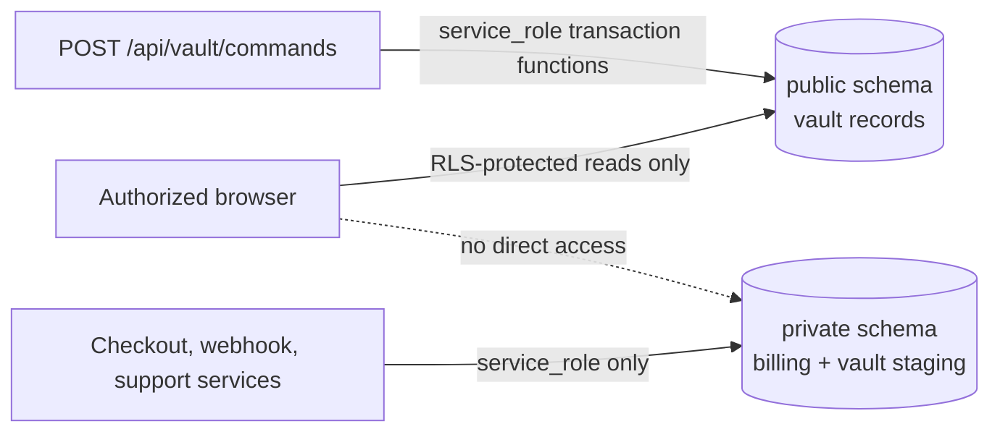
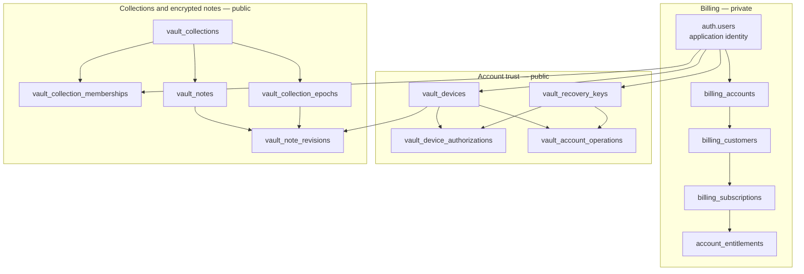
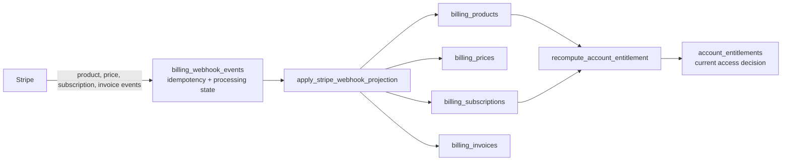
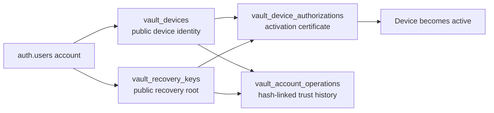
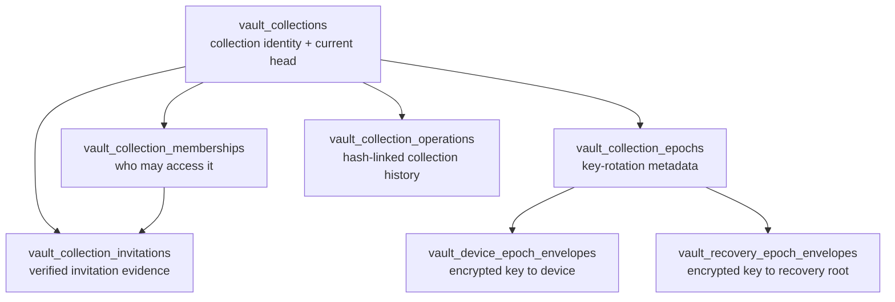
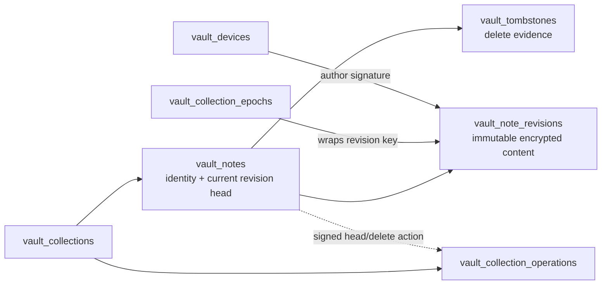

# Database tables

This is a practical map of the server database: what each table represents,
which code may change it, and how the tables fit together. For column-level
detail, see [Data model and column dictionary](models.md). For the vault's
security design, see [Architecture and trust model](architecture.md).

## Read this first

There are two deliberately separate areas of the database.



| Area | Holds | Who can read it | Who can change it |
| --- | --- | --- | --- |
| `public` | Encrypted vault data, public keys, signed records, and access metadata | An authenticated browser, but only rows permitted by RLS | Private transaction functions invoked by server routes |
| `private` | Billing projections, entitlement state, and temporary enrollment state | `service_role` server code only | Server routes, database triggers, migrations, and private functions |

The browser has **no direct `INSERT`, `UPDATE`, or `DELETE` grants** on vault
tables. Vault mutations flow through `POST /api/vault/commands`. Neither schema
stores vault plaintext, private keys, recovery secrets, or local browser-unlock
material.

**Implemented** means a table is used at runtime. **Reserved** means it exists
for planned work and is not active in v1.

## At a glance



Arrows show the main ownership/reference paths, not every foreign key.

## Billing and account tables (`private`)

Stripe is the source of commercial events. The application stores a local,
query-friendly projection and derives one current entitlement per billing
account.



### Plan catalogue

| Table | Role and relationships | Runtime access and lifecycle |
| --- | --- | --- |
| `private.plans` | Master plan catalogue (`free`, `pro`). Parent of `plan_features`, `billing_products`, and `account_entitlements`. | **Implemented.** Seeded by migration; migrations deactivate rather than delete a plan. Read by entitlement recomputation. |
| `private.plan_features` | Typed feature limits/capability flags for a plan. Child of `plans`. | **Reserved.** Seeded by migration but not yet evaluated at runtime. |

### Billing identity and Stripe projection

| Table | Role and relationships | Writer, reader, lifecycle |
| --- | --- | --- |
| `private.billing_accounts` | One local billing owner per user today. Parent of customer, subscription, invoice, entitlement, and future AI allowance rows. Organization-owned accounts are planned. | **Implemented.** `create_personal_billing_account` trigger creates it on `auth.users` insert. Checkout and entitlement functions read it; it closes with the account. |
| `private.billing_customers` | Maps a billing account to a Stripe Customer ID; `livemode` separates test/live data. Email is not the identity key. Parent of subscriptions. | **Implemented.** Checkout creates it on first Checkout/Portal interaction. Checkout and webhook projection read it; `stripe_deleted_at` records Stripe deletion. |
| `private.billing_products` | Local Stripe Product projection, linked to a ClipsX plan. Parent of prices. | **Implemented.** Webhook projection upserts it for `product.*`; entitlement recomputation reads it. |
| `private.billing_prices` | Local Stripe Price projection. `lookup_key` is the stable deployment-safe handle. Parent of subscription items. | **Implemented.** Webhook projection upserts it for `price.*`; checkout reads it. Prices are deactivated, not deleted. |
| `private.billing_subscriptions` | Local Stripe Subscription projection: status, cancellation, trial, and pause state. Child of billing account/customer; parent of items and invoices. | **Implemented.** Webhook projection upserts it for `customer.subscription.*`; entitlement recomputation reads it. `canceled` and `ended` rows remain for history. |
| `private.billing_subscription_items` | One price/quantity slot in a subscription, including item-level billing period dates. Child of subscription and price. | **Implemented.** Upserted with its subscription; read by entitlement recomputation. |
| `private.billing_invoices` | Dunning/support invoice projection: status, amounts, payment time, and next attempt. It excludes payment-method details. Child of billing account and subscription. | **Implemented.** Webhook projection upserts it for `invoice.*`; support tooling reads it. |

### Webhook safety and access decisions

| Table | Role and relationships | Writer, reader, lifecycle |
| --- | --- | --- |
| `private.billing_webhook_events` | The idempotency boundary and durable audit log for Stripe deliveries. It deliberately has no business-table parent. | **Implemented.** The webhook route claims an event, then completes or fails it in the same transaction as the projection. State: `pending → processing → processed` or `failed`; failures remain for support replay. |
| `private.account_entitlements` | Exactly one current access decision per billing account: effective plan, Stripe source, status (`active`, `grace`, `read-only`), and dates. Child of billing account and plan; references its source subscription. | **Implemented.** `recompute_account_entitlement` upserts it inside the webhook projection transaction. The billing summary route reads a limited browser-safe summary. |

### Reserved Team and AI tables

| Table | Planned role | Current state |
| --- | --- | --- |
| `private.organizations` | Team workspace identity. Will own one organization-kind billing account. | **Reserved.** Team checkout, seats, and member management are not implemented. |
| `private.organization_memberships` | Team workspace role (`owner`, `admin`, `member`), distinct from encrypted collection membership. Child of organization and `auth.users`. | **Reserved.** No runtime reads or writes. |
| `private.ai_allowance_periods` | Monthly AI allowance window per billing account: plan/item basis, granted/consumed capacity, and idempotency key. | **Reserved.** Not populated or enforced. |
| `private.ai_usage_events` | Future usage ledger for the payer, optional Team actor, allowance window, event kind, and signed unit delta. Prompts and AI output are never stored. | **Reserved.** Not populated or enforced. |

## Vault enrollment staging (`private`)

These short-lived tables let the server coordinate enrollment without receiving a
private key or recovery secret.

```mermaid
sequenceDiagram
  participant New as New browser device
  participant Pending as pending device registration
  participant Challenge as registration challenge
  participant Authorizer as Authorized device or recovery key
  participant Public as public vault tables

  New->>Pending: submit public metadata + device-register proof
  New->>Challenge: receive encrypted challenge; return its hash
  Authorizer->>Public: authorize pending device
  Public->>Challenge: verify and consume challenge
  Public->>Pending: atomically consume pending registration
  Public-->>New: active device record and authorized envelopes
```

| Table | Role | Writer, reader, lifecycle |
| --- | --- | --- |
| `private.vault_device_registration_challenges` | SHA-256 hash of a one-time enrollment challenge plus expiry/consumption metadata. References `auth.users` and `public.vault_devices`. It never stores the raw/decrypted challenge, a private key, or a recovery secret. | **Implemented.** Registration functions create it; `consume_vault_device_registration_challenge` consumes it and authorization verifies it. Expired rows may be cleaned up. |
| `private.vault_pending_device_registrations` | Short-lived staging record for a device waiting for QR/SAS authorization. References `auth.users` and `public.vault_devices`; holds only public metadata and the `device-register` proof. | **Implemented.** `register_pending_vault_device` creates it. Authorization consumes it atomically; expiry is 15 minutes. |

## Vault trust tables (`public`)

These tables answer: “Which devices and recovery roots may act for this account,
and what signed history proves that?” All are browser-readable only where their
RLS policy permits it.



| Table | What it represents | Writer, reader, lifecycle |
| --- | --- | --- |
| `public.vault_devices` | One immutable cryptographic browser-device identity: public keys and non-secret metadata only. Parent of device authorizations and device envelopes; referenced by operations, revisions, invitations, and memberships. | **Implemented.** Initial/pending-device registration creates it; revocation sets `revoked_at`. Browser reads its own account rows via RLS. State: `pending → active → revoked`; a revoked row is terminal and re-enrollment creates a new row. |
| `public.vault_recovery_keys` | Versioned public recovery root derived in the browser from the offline 24-word phrase. It contains no recovery secret or private key. Referenced by authorizations, account operations, and recovery envelopes. | **Implemented.** Initial registration creates the first row; recovery-root rotation creates a higher version. Browser reads its own rows via RLS. State: `active → revoked`; at most one active key per account. |
| `public.vault_device_authorizations` | Append-only signed `DeviceAuthorization` certificate and possession proof that activates a device. Child of account/device; has exactly one authorizer: a device or recovery key. | **Implemented.** Pending-device or recovery authorization writes it. Browser reads its own account rows via RLS. One activation per device. |
| `public.vault_account_operations` | Append-only, hash-linked account trust history for authorization, revocation, and recovery-root rotation. It references exactly one signing authority: device or recovery key. | **Implemented.** Private vault-command transactions add rows after signature verification. Browser and `read_vault_account_sync_page` read it. Sequence number, operation ID, and operation hash are unique. |

## Collections, membership, and epoch keys (`public`)

A collection is both the sharing boundary and the encryption-key rotation
boundary. The server stores public metadata and encrypted envelopes, never the
plaintext collection epoch key.



| Table | What it represents | Writer, reader, lifecycle |
| --- | --- | --- |
| `public.vault_collections` | Collection identity, encrypted presentation metadata, and current epoch/transition head; no plaintext collection key. Parent of every collection-scoped table below. | **Implemented.** `create_vault_collection` creates it; member-add/remove rotation functions advance its head. Members read it through `can_read_vault_collection` RLS. Soft deletion after all members are removed is planned, not implemented. |
| `public.vault_collection_memberships` | An account’s role, status, epoch history boundary, and membership lifecycle in a collection. Child of collection and `auth.users`; links to the invitation and signed membership operation. | **Implemented.** Collection creation creates the owner membership; add/remove rotations activate or remove it. State: `invited → active → removed`; removal is terminal and rejoining uses a new row. |
| `public.vault_collection_invitations` | Signed, commitment-only evidence for a cross-user invitation. It stores no high-entropy invitation secret. Child of collection and membership; references inviter and accepting devices. | **Implemented.** Invite, accept, confirm, and member-add functions update it. Inviter/recipient can read it through RLS, but an invitee cannot read the collection until membership activates. State: `created → accepted`, `expired`, or `cancelled`; terminal states do not reactivate. |
| `public.vault_collection_epochs` | Append-only public metadata for each collection key epoch: rotation reason, commitments, transition hash, creator, and protocol version. The epoch key itself is absent. | **Implemented.** Collection creation writes epoch 1; rotation transactions add later epochs. Members read it via RLS. State: `created → current → superseded`; epoch numbers never decrease or reactivate. |
| `public.vault_device_epoch_envelopes` | Append-only HPKE-encrypted delivery of an epoch key to an authorized device, signed by the sender. Child of collection/epoch; references recipient and sender devices. | **Implemented.** Creation, device authorization, and rotations write it. A device reads only envelopes addressed to its account via RLS. Revoked devices receive no later-epoch envelope. |
| `public.vault_recovery_epoch_envelopes` | Append-only encrypted delivery of an epoch key to an eligible active recovery key. Child of collection/epoch; recipient is a recovery key, and sender is exactly one device or recovery key. | **Implemented.** Creation, rotations, and recovery-root rotation write it. RLS permits an owner’s active recovery key. Removed members and revoked keys receive no later-epoch envelope. |
| `public.vault_collection_operations` | Append-only, hash-linked log of collection membership, invitation, epoch, note-head, and revocation operations. Child of collection; references the author device. | **Implemented.** Every modifying vault-command transaction writes it. Collection members and the private sync route read it. Sequence number, operation ID, and hash are unique. |

## Notes and deletion evidence (`public`)

The product calls a saved item a **note**. A note is a stable identity; each
content change is a separate immutable encrypted revision.



| Table | What it represents | Writer, reader, lifecycle |
| --- | --- | --- |
| `public.vault_notes` | Stable note identity and current accepted revision number/hash. It contains no plaintext content. Child of collection; parent of revisions and tombstones. | **Implemented.** The first `append_vault_note_revision` creates it; later revisions update its head. `delete_vault_note` sets `deleted_at`. Members and the private sync route read it. A deleted note cannot receive another revision. |
| `public.vault_note_revisions` | Immutable authenticated ciphertext, wrapped revision key, hashes, and author signature for one note version. Child of note/collection; references its wrapping epoch and author device. | **Implemented.** `append_vault_note_revision` inserts it with optimistic concurrency. Members and private sync read it. The row is immutable; deletion may remove ciphertext/wrapped key under retention policy without removing the history row. |
| `public.vault_tombstones` | Append-only, signed deletion evidence preserving the delete-operation reference and last revision hash after product-policy deletion. Child of collection; references note and signed operation. | **Implemented.** `delete_vault_note` writes it. Members and private sync read it. One persistent tombstone exists per deleted note. |

## Data-handling rules

| Data type | Where it may exist | Where it must not exist |
| --- | --- | --- |
| Vault plaintext, private device keys, recovery secrets, browser-unlock material | Only in the authorized browser runtime; protected local device material may be encrypted in IndexedDB | Any database table, logs, or server-side staging table |
| Public keys, signatures, hashes, ciphertext, encrypted envelopes | The relevant `public.vault_*` table | Plaintext-only application fields |
| Stripe billing identity and projected billing state | `private` billing tables | Browser-accessible private schema rows |
| Enrollment proof state | Short-lived `private` staging tables | Long-term records containing private key material or decrypted challenge data |

## Operational checks

- Treat `billing_webhook_events` failures as replayable support work; do not
  delete them to retry a Stripe event.
- Expired registration challenges and pending registrations may be cleaned up;
  authorization must consume their state atomically.
- Do not repair vault histories by editing append-only operation, epoch,
  authorization, revision, envelope, or tombstone rows. Use the corresponding
  command/recovery flow so signatures and hash chains remain valid.

