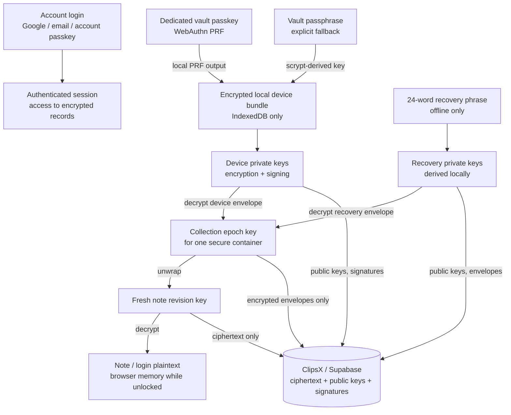
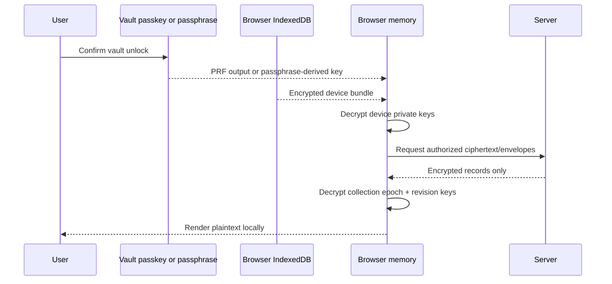
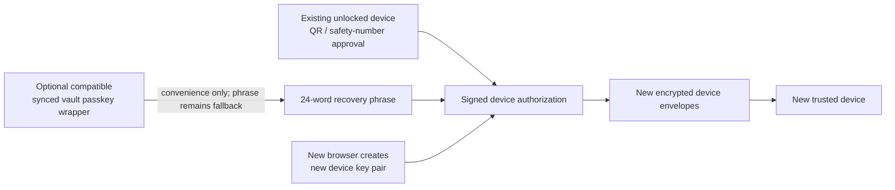
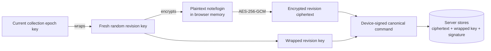
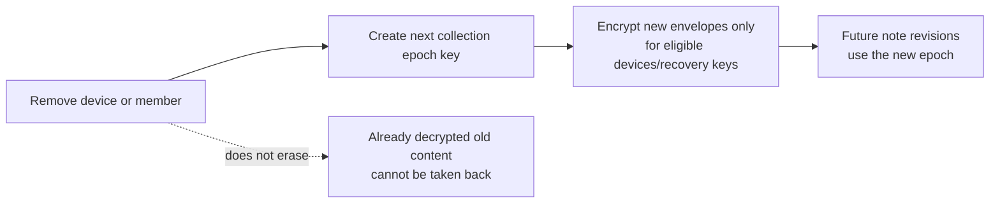

# Vault key lifecycle

This visual guide explains which secret does what in ClipsX vault v1. It is an
architectural guide; [Vault protocol v1](vault-protocol-v1.md) remains the
normative implementation contract.

## One-page map

The server can authenticate an account and synchronize encrypted records. It
does not receive the recovery phrase, PRF output, vault passphrase, private
keys, collection epoch keys, or plaintext content.

## Key roles and locations

| Item | Role | Stored / available at | Server sees |
| --- | --- | --- | --- |
| Account session | Accesses account-scoped API and encrypted records | Browser session / Supabase Auth | Session and account identity |
| Vault passkey PRF output | Derives the local bundle-unlock key | Browser memory during a WebAuthn ceremony | Never the output |
| Vault passphrase | Fallback local bundle-unlock secret | User memory/password manager only | Never |
| Device private keys | Decrypt device envelopes and sign vault operations | Encrypted local IndexedDB bundle, then unlocked memory | Never |
| Device public keys | Encrypt to and verify one device | Server | Public key only |
| Recovery phrase | Offline ownership and last-resort recovery | User-controlled offline storage | Never |
| Recovery private keys | Recover/enroll devices and decrypt recovery envelopes | Derived transiently from the phrase | Never |
| Recovery public keys | Encrypt recovery envelopes and verify root actions | Server | Public key only |
| Collection epoch key | Shared key generation for one collection | Unlocked device memory / encrypted local cache | Encrypted envelopes only |
| Revision key | Fresh key for one note/login revision | Wrapped under its epoch key | Wrapped key + ciphertext only |

## Normal unlock on an existing browser

## Add a device or recover after loss

An account login alone cannot make a new browser a trusted vault device. The
new device needs an authorization rooted in an existing trusted device or the
offline recovery root.

## Write one note or login record

Every note revision receives a fresh key. The collection epoch key does not
encrypt every note directly; it protects the fresh revision key instead.

## Revoke a device or member

Revocation protects future writes. It cannot erase data already decrypted or
copied by a removed device/member.

## Recovery-root rotation

Rotate the 24-word phrase only when it may be compromised, was stored
unsafely, or is no longer available to the owner. The operation requires fresh
account confirmation plus current vault proof; it creates new recovery keys and
rotates affected collection epochs. It is not routine password maintenance.
