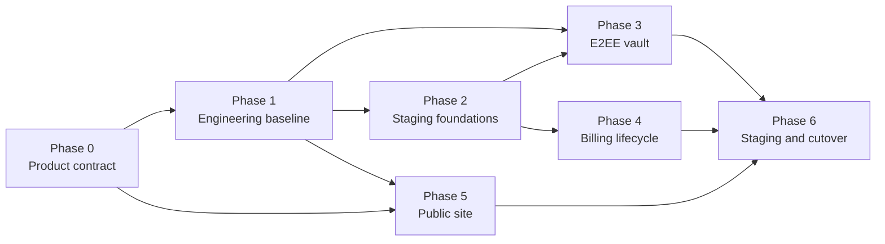

# ClipsX v1 launch execution plan

This plan turns the readiness checklist into an ordered delivery plan. It is
for the public paid launch described in [deployment-readiness.md](deployment-readiness.md):
Vercel, hosted Supabase, Stripe, website authentication, desktop downloads,
and an E2EE browser vault. Team billing and hosted AI are out of scope.

## Rules for sequencing

1. Do not publish a claim, price, or legal commitment before the underlying
   product decision is recorded and the desktop release supports it.
2. Do not add vault UI before the database authorization model, recovery model,
   and automated RLS tests are complete.
3. Do not configure live billing or make the site public until sandbox billing,
   account recovery, and the deployment rollback procedure have passed.
4. Each phase has a demonstrable exit condition. Work within a phase can be
   parallelized only after its listed prerequisites are satisfied.

## Phase 0 — lock the public product contract

**Purpose:** remove contradictions before the site, legal text, and Stripe
catalog make promises to customers.

- Decide and record the v1 Free/Pro feature matrix, storage limits, retention,
  sharing rules, recovery limits, supported desktop platforms, and launch price
  and currency.
- Confirm the legal entity, controller/support contact, governing law, refund
  policy, and whether tax registration is needed before launch.
- Confirm the desktop repository, first release version, signed artifact names,
  checksum location, and deep-link registration on all supported platforms.
- Reconcile `docs/product-strategy.md`, public English/Japanese copy, pricing,
  FAQ, features, and blog plans with that contract. In particular, its current
  hosted-Claude and AI-allowance statements conflict with the v1 scope in the
  backend and deployment docs; they must be removed or explicitly deferred.

**Exit condition:** one approved v1 feature/pricing/legal brief exists and no
public page or product document advertises deferred AI, credits, or Team
functionality.

## Phase 1 — restore a reproducible engineering baseline

**Prerequisite:** Phase 0 product scope is stable enough to test.

**Current status (2026-07-27):** locally verified. The GitHub Actions workflow
has been added and still needs its first remote run.

- Confirm `package.json`, lockfile, and installed dependencies reproduce from a
  clean, supported Node version.
- Keep ESLint errors at zero and address new warnings where practical.
- Run and make repeatable: unit tests, local Supabase reset, database tests,
  typecheck, lint, and production build.
- Add CI for dependency installation and those checks. Preserve test output as
  build artifacts when a database job is available.
- Correct stale documentation that claims the quality gates pass while they do
  not.

**Exit condition:** a clean checkout passes `npm ci`, `npm run test:unit`,
`npm run supabase:reset`, `npm run test:db`, `npm run typecheck`, `npm run
lint`, and `npm run build`; CI enforces the applicable subset on every change.

## Phase 2 — establish non-production external foundations

**Prerequisite:** Phase 1.

- Create a dedicated hosted Supabase staging project and apply the reviewed
  migrations; retain a documented migration/rollback process.
- Configure Google OAuth and Supabase Auth for website and desktop callbacks,
  confirmation, reset, sign-out, and session expiry. Rotate the previously
  exposed Supabase secret key.
- Bootstrap the Stripe sandbox catalog with the approved price decisions and
  configure the signed staging webhook.
- Select and configure a monitored transactional email provider for support;
  add rate limiting/abuse protection before wiring the contact form.
- Set up a staging Vercel deployment with only the required server-side and
  browser-safe variables. Store no secret in the repository.

**Exit condition:** staging web and desktop Google sign-in work for the same
user, a sandbox webhook reaches the endpoint, and a contact submission is
accepted by the monitored inbox.

## Phase 3 — implement and verify the E2EE browser vault

**Prerequisite:** Phase 1. Phase 2 staging credentials are needed before final
end-to-end verification.

1. Add the documented vault schema, constraints, narrow RPCs, grants, RLS, and
   pgTAP tests. Prove cross-user denial, pending-member denial, revoked-device
   denial, and tombstone behavior.
2. Implement browser-device enrollment: create a Web Crypto key pair, persist
   a non-extractable private `CryptoKey` in IndexedDB, and register only the
   public key with Supabase.
3. Implement trusted-device approval and recovery-code restoration entirely
   locally. Define the no-device/no-recovery failure state explicitly.
4. Implement the initial read-only password and encrypted-note viewer. It may
   decrypt only in the browser and must avoid plaintext, recovery-code, and
   private-key logging.
5. Add the high-risk-route controls: strict CSP, no third-party scripts or
   analytics, safe rendering/XSS protections, in-memory lock/sign-out cleanup,
   and explicit browser-device revocation.
6. Test the full device lifecycle in browser and database tests.

**Exit condition:** an enrolled user can recover, view, sign out, and revoke a
browser vault device; a second user and revoked device are denied; Supabase
never receives plaintext or a private key.

## Phase 4 — finish billing correctness and exercise lifecycle failures

**Prerequisite:** Phase 1 and the sandbox foundation in Phase 2.

- Change Checkout to detect every non-terminal subscription before creating a
  session and direct the user to Customer Portal instead.
- Ensure entitlement selection prefers an otherwise-valid existing
  subscription over a newer failed/incomplete record.
- Make pricing and account errors actionable for unavailable configuration,
  duplicate subscriptions, portal failures, and rejected workspaces.
- Use Stripe sandbox, CLI, and Test Clocks to verify monthly/annual purchase,
  cancellation, refund, payment failure, webhook retries, replay, and
  re-subscription. Exercise the documented support replay command.
- Record the exact production webhook event set and operational owner/runbook.

**Exit condition:** billing can neither create duplicate subscriptions nor
remove valid access due to out-of-order or failed subscription state; every
listed Stripe lifecycle scenario has a recorded passing test.

## Phase 5 — complete the public website and support surface

**Prerequisite:** Phase 0; download verification also needs the release from
Phase 0. This phase can run in parallel with Phases 3 and 4 after Phase 1.

- Replace download placeholders with verified release URLs, availability state,
  checksums, and signing/install guidance for each supported platform.
- Replace Privacy and Terms templates with reviewed, localized legal text.
- Complete the English/Japanese copy review across homepage, features, pricing,
  FAQ, account, download, support, and AI descriptions.
- Publish the three localized blog articles; add localized routes, metadata,
  canonical URLs, internal links, and sitemap coverage.
- Finish contact delivery and abuse protections, then test it against the
  monitored support workflow.

**Exit condition:** all public pages accurately reflect the approved v1
contract in both languages, installers work from a published release, legal
pages are approved, and support messages are deliverable.

## Phase 6 — staging rehearsal and production cutover

**Prerequisite:** Phases 2–5.

- Run the full acceptance checklist on staging: browser/web login, desktop
  handoff, downloads, vault enrollment/recovery/revocation, billing, contact,
  localization, and accessibility/smoke checks.
- Freeze migration and catalog changes, back up/export the operational
  configuration, and document the precise rollback, webhook replay, support
  escalation, and account-recovery steps.
- Apply verified migrations to production, configure production Vercel,
  Supabase, Stripe, Google, support-email, and desktop deep-link variables,
  and register the production webhook.
- Bootstrap/review the live Stripe catalog only after legal pricing, refunds,
  and tax decisions are final. Run a controlled live smoke test.

**Exit condition:** every item under “Launch acceptance” in
`deployment-readiness.md` is checked with dated evidence, the owners know the
rollback and support procedures, and production smoke tests pass.

## Critical path and parallel work

The critical path is Phase 0 → Phase 1 → Phase 2 → Phases 3/4 → Phase 6.
Phase 5 should proceed alongside vault and billing work once the product
contract and engineering baseline are in place.
